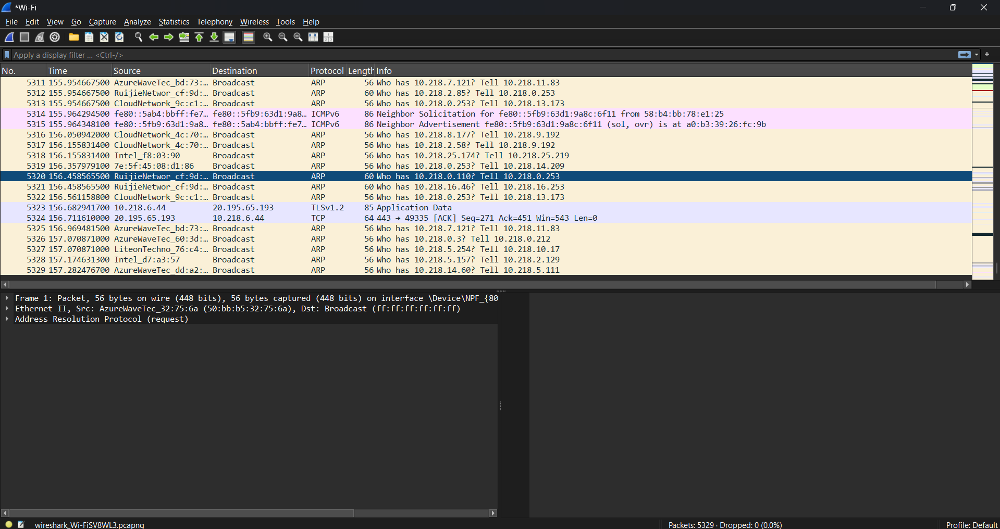
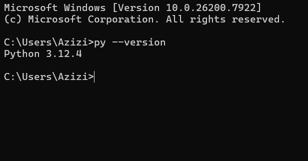

# Laporan Praktikum Jaringan Komputer - Minggu 1
## Modul 1: Running Modul

* **Nama:** Muhammad Rohman Azizi
* **NIM:** 103072400011
* **Jurusan:** Informatika
* **Fakultas:** Informatika
* **Universitas:** Universitas Telkom Surabaya
* **Tahun:** 2026

---

### 1. Tujuan Praktikum
Memastikan kelengkapan *tools* yang dibutuhkan untuk praktikum Jaringan Komputer telah terinstal dengan baik di komputer lokal, yaitu Wireshark dan Python.

### 2. Instalasi Wireshark
* Wireshark merupakan aplikasi *network protocol analyzer*. Installer diunduh melalui situs resmi: [http://www.wireshark.org/](http://www.wireshark.org/)
* Proses instalasi dilakukan dengan menjalankan *installer* dan mengikuti wizard instalasi (*Next* hingga *Finish*).
* 

### 3. Instalasi dan Verifikasi Python
* Python diunduh melalui situs resmi: [https://www.python.org/downloads/](https://www.python.org/downloads/)
* Untuk memverifikasi apakah Python sudah terinstal dengan benar dan terdaftar di *environment variables*, dilakukan pengecekan melalui Command Prompt dengan mengeksekusi perintah berikut:
  py --version
* 