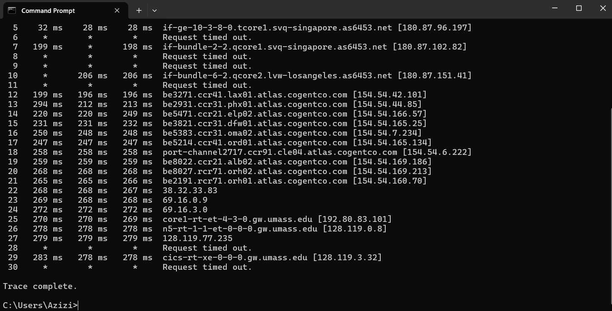
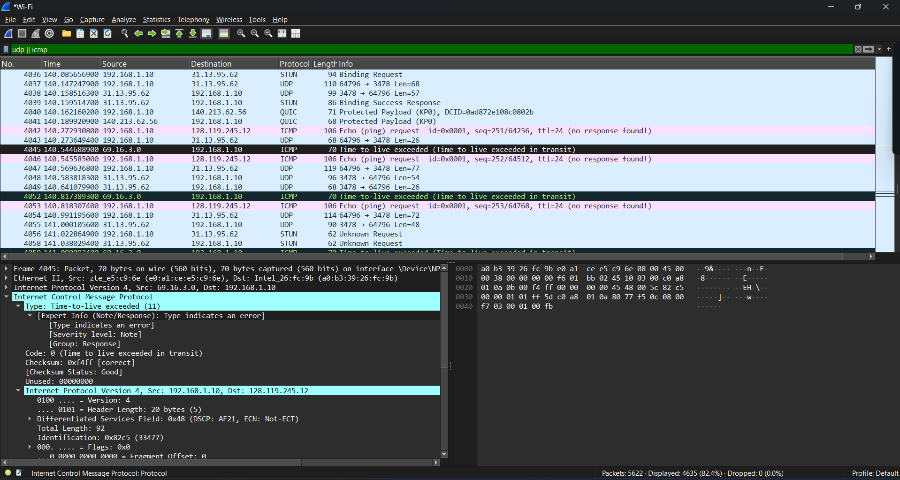
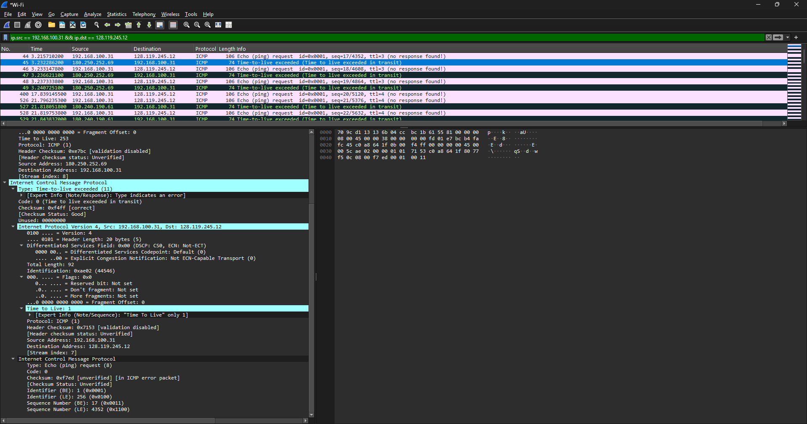
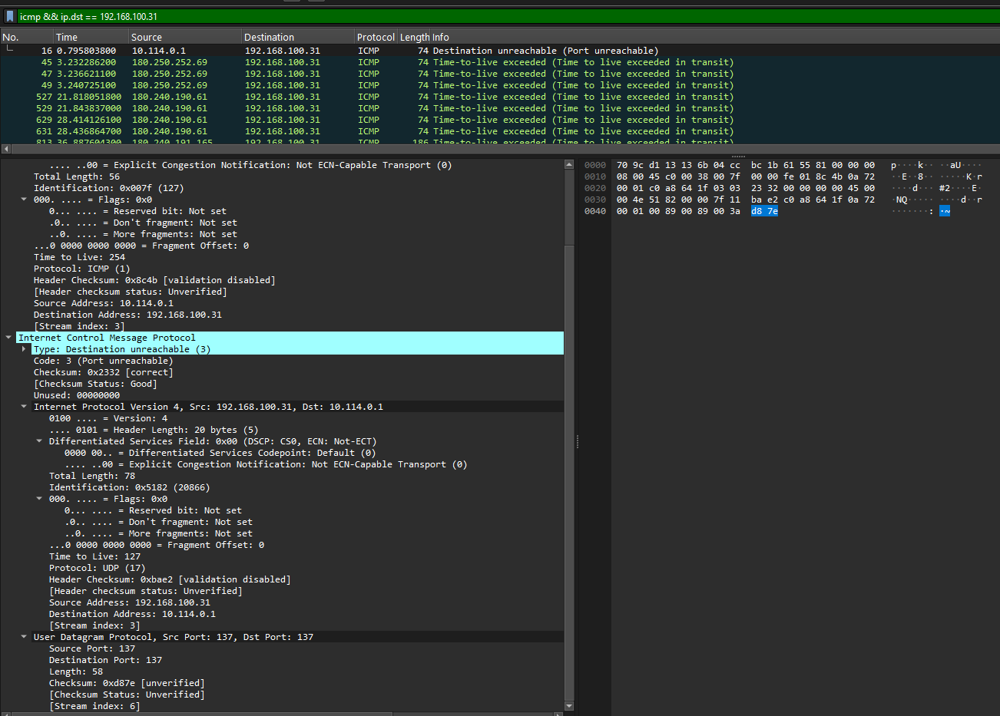
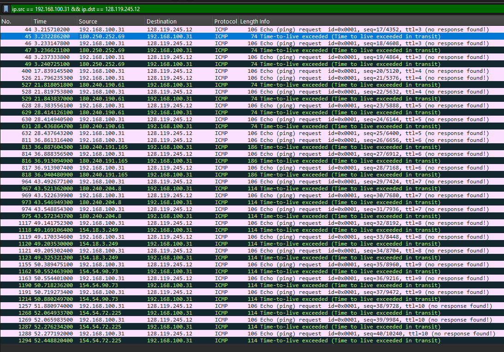
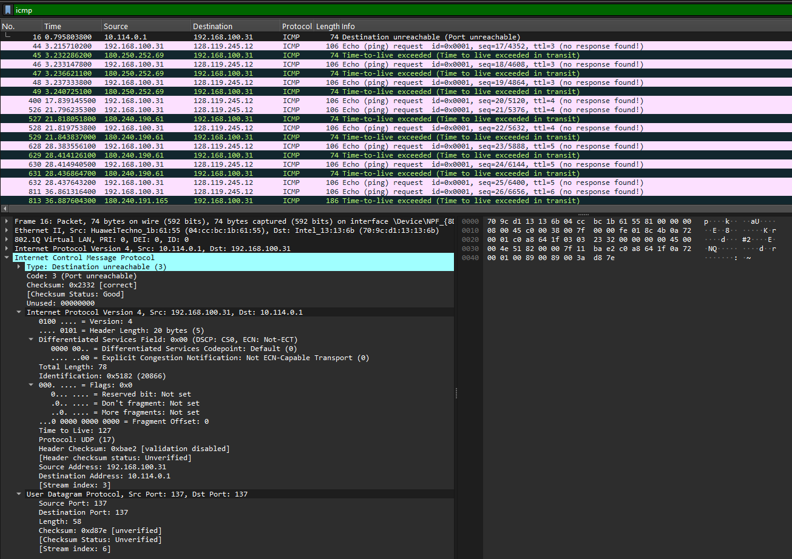

# Laporan Praktikum Jaringan Komputer - Modul 10
## Internet Protocol (IP) Analysis

### Identitas Praktikan
| Item | Keterangan |
|------|-----------|
| **Nama** | Muhammad Rohman Azizi |
| **NIM** | 103072400011 |
| **Kelas** | IF-04-01 |

---

## 1. Tujuan Praktikum
1. Menganalisis cara kerja protokol IP menggunakan Wireshark
2. Memahami struktur header IPv4 dan field-field penting
3. Mempelajari fragmentasi IP pada datagram besar
4. Mengenal datagram IPv6

---

## 2. Langkah Praktikum

### 2.1 Capture Paket Traceroute

**Langkah-langkah:**

1. **Start Wireshark capture**
   - Buka Wireshark dan pilih interface aktif (Wi-Fi)
   - Klik tombol Start Capture

2. **Jalankan traceroute**
   ```cmd
   #cmd
   tracert gaia.cs.umass.edu
   ```

3. **Stop capture setelah traceroute selesai**

4. **Filter paket di Wireshark:**
   ```
   icmp && ip.dst == 192.168.100.31
   ```

---

## 3. Hasil Praktikum

### 3.1 Bagian 1: Analisis IPv4 Dasar

**Filter Wireshark yang Digunakan:**
```
ip.src == 192.168.100.31 && ip.dst == 128.119.245.12
```

**Hasil Capture Wireshark:**



*Gambar 1: Paket ICMP dari traceroute ke gaia.cs.umass.edu (128.119.245.12)*

**Analisis Paket ICMP dari Traceroute:**

Dari screenshot di atas, terlihat paket-paket ICMP dengan berbagai TTL:

| No | Frame | Source | Destination | TTL | Info |
|----|-------|--------|-------------|-----|------|
| 1 | 44 | 192.168.100.31 | 128.119.245.12 | 3 | Echo (ping) request |
| 2 | 45 | 180.250.252.69 | 192.168.100.31 | - | Time-to-live exceeded |
| 3 | 46 | 192.168.100.31 | 128.119.245.12 | 3 | Echo (ping) request |
| 4 | 47 | 180.250.252.69 | 192.168.100.31 | - | Time-to-live exceeded |
| 5 | 400 | 192.168.100.31 | 128.119.245.12 | 4 | Echo (ping) request |
| 6 | 628 | 192.168.100.31 | 128.119.245.12 | 5 | Echo (ping) request |

**Penjelasan:**
- **Paket ungu/merah muda**: ICMP Echo Request dari client dengan TTL increasing (3, 4, 5, ...)
- **Paket hijau/biru**: ICMP Time-to-live exceeded dari router intermediate
- Router dengan IP **180.250.252.69**, **180.240.190.61**, **180.240.191.165** mengirim ICMP Type 11

---

### 3.2 Detail Header IPv4 dan ICMP

**Paket ICMP Destination Unreachable:**



*Gambar 2: Detail paket ICMP Type 3 (Destination unreachable) Code 3 (Port unreachable)*

**Struktur ICMP Destination Unreachable:**

```
Internet Control Message Protocol
    Type: 3 (Destination unreachable)
    Code: 3 (Port unreachable)
    Checksum: 0x2332 [correct]
    [Checksum Status: Good]
    Unused: 00000000
```

**Analisis:**
- **Type 3** = Destination unreachable
- **Code 3** = Port unreachable
- Ini terjadi karena traceroute (Windows tracert) mengirim ke port yang tidak digunakan
- Router **10.114.0.1** mengirim pesan error ini kembali ke **192.168.100.31**

**Header IPv4 dalam ICMP Error:**
```
Internet Protocol Version 4, Src: 192.168.100.31, Dst: 10.114.0.1
    Version: 4
    Header Length: 20 bytes (5)
    Total Length: 78
    Identification: 0x5182 (20866)
    Flags: 0x00
    Fragment Offset: 0
    Time to Live: 127
    Protocol: UDP (17)
    Source Address: 192.168.100.31
    Destination Address: 10.114.0.1
```
---

### 3.3 Analisis ICMP Echo Request (Ping)

**Detail Frame 44 - ICMP Echo Request:**



*Gambar 3: Detail ICMP Echo Request dengan TTL=3 (Frame 44)*

**Header IPv4 (Frame 44):**

```
Internet Protocol Version 4, Src: 192.168.100.31, Dst: 128.119.245.12
    0100 .... = Version: 4
    .... 0101 = Header Length: 20 bytes (5)
    Differentiated Services Field: 0x00 (DSCP: CS0, ECN: Not-ECT)
    Total Length: 92
    Identification: 0xae02 (44546)
    Flags: 0x00
    .... ...0 0000 0000 0000 000 = Fragment Offset: 0
    Time to Live: 3
    Protocol: ICMP (1)
    Header Checksum: 0x0000 [validation disabled]
    [Header checksum status: Unverified]
    Source Address: 192.168.100.31
    Destination Address: 128.119.245.12
```

**Header ICMP:**

```
Internet Control Message Protocol
    Type: 8 (Echo (ping) request)
    Code: 0
    Checksum: 0xf7ed [correct]
    [Checksum Status: Good]
    Identifier (BE): 1 (0x0001)
    Identifier (LE): 256 (0x0100)
    Sequence Number (BE): 17 (0x0011)
    Sequence Number (LE): 4352 (0x1100)
    [No response seen]
    Data (64 bytes)
```

---

### 3.4 Analisis ICMP Time-to-Live Exceeded

**Detail ICMP Type 11:**



*Gambar 4: Detail ICMP Time-to-live exceeded (Type 11, Code 0)*

**Struktur ICMP TTL-Exceeded:**

```
Internet Control Message Protocol
    Type: Time-to-live exceeded (11)
    [Expert Info (Note/Response): Type indicates an error]
    Code: 0 (Time to live exceeded in transit)
    Checksum: 0xf4ff [correct]
    [Checksum Status: Good]
    Unused: 00000000
```

**Analisis:**
- **Type 11** = Time-to-live exceeded
- **Code 0** = TTL expired in transit
- Dikirim oleh router **180.250.252.69** ke **192.168.100.31**
- Router mengurangi TTL dari paket asli menjadi 0, lalu mengirim error ini

**Original Datagram (dalam ICMP error):**
```
Internet Protocol Version 4, Src: 192.168.100.31, Dst: 128.119.245.12
    Time to Live: 1
    Protocol: ICMP (1)
```
Terlihat TTL asli = 1, yang sudah expire di router ini.

---

### 3.5 Analisis TTL (Time to Live)

**Cara Kerja TTL pada Traceroute:**



*Gambar 5: Paket dengan TTL berbeda (3, 4, 5) menunjukkan mekanisme traceroute*

**Penjelasan:**

| TTL | Hop yang Dicapai | Response Router |
|-----|------------------|-----------------|
| 1 | Router 1 (192.168.100.1) | ICMP TTL-exceeded |
| 2 | Router 2 (10.159.118.1) | ICMP TTL-exceeded |
| 3 | Router 3 (180.250.252.69) | ICMP TTL-exceeded |
| 4 | Router 4 (180.240.190.61) | ICMP TTL-exceeded |
| 5 | Router 5 (180.240.191.165) | ICMP TTL-exceeded |
| ... | ... | ... |
| N | Destination (128.119.245.12) | ICMP Echo Reply |

**Dari Screenshot:**
- **Frame 44, 46, 48**: TTL = 3
- **Frame 400, 526**: TTL = 4  
- **Frame 628, 630, 631**: TTL = 5
- **Frame 811, 813**: TTL = 6
- **Frame 1117, 1119**: TTL = 8
- **Frame 1257, 1268**: TTL = 10

Terlihat TTL meningkat secara bertahap (3, 4, 5, 6, 8, 10...), sesuai cara kerja traceroute.

---

### 1.2.6 Filter dan Analisis Paket

**Filter yang Digunakan:**

1. **Tampilkan semua ICMP:**
   ```
   icmp
   ```

2. **Tampilkan ICMP ke komputer lokal:**
   ```
   icmp && ip.dst == 192.168.100.31
   ```

3. **Tampilkan paket ke tujuan:**
   ```
   ip.src == 192.168.100.31 && ip.dst == 128.119.245.12
   ```

**Hasil Filter:**



*Gambar 6: Hasil filter ICMP packets di Wireshark*

---

### 3.7 Bagian 2: Fragmentasi IP

**Catatan Penting:**

Pada capture ini, **tidak terlihat fragmentasi** karena:

1. **Ukuran paket kecil**: Total Length = 92 bytes (atau 78 bytes untuk beberapa paket)
2. **MTU jaringan Ethernet** = 1500 bytes
3. **92 < 1500** → **tidak perlu fragmentasi**

**Flags di Header IPv4 (dari screenshot):**
```
Flags: 0x00
    0... .... = Reserved bit: Not set
    .0.. .... = Don't fragment: Not set
    ..0. .... = More fragments: Not set
    ...0 0000 0000 0000 000 = Fragment Offset: 0
```

Terlihat **MF (More Fragments) = 0** dan **Fragment Offset = 0**, konfirmasi bahwa paket tidak terfragmentasi.

**Teori Fragmentasi:**

Jika datagram 3000 bytes dikirim melalui jaringan dengan MTU 1500 bytes:

| Fragment | Total Length | Fragment Offset | Flags (MF) |
|----------|--------------|-----------------|------------|
| 1 | 1500 bytes | 0 | MF=1 (More Fragments) |
| 2 | 1500 bytes | 1480 | MF=1 (More Fragments) |
| 3 | 60 bytes | 2960 | MF=0 (Last fragment) |

**Perhitungan:**
```
Datagram asli: 3000 bytes
MTU: 1500 bytes
Header IP: 20 bytes
Payload maksimal per fragment: 1500 - 20 = 1480 bytes

Fragment 1: Offset 0,     Length 1500 (20 header + 1480 data)
Fragment 2: Offset 1480,  Length 1500 (20 header + 1480 data)  
Fragment 3: Offset 2960,  Length 60   (20 header + 40 data)
```

**Field Fragmentasi di Header IPv4:**
- **Identification**: Sama untuk semua fragment (misal 0x5678)
- **Flags MF**: 
  - MF=1 → masih ada fragment berikutnya
  - MF=0 → fragment terakhir
- **Fragment Offset**: Posisi fragment dalam byte (dibagi 8)

**Mengapa Windows tracert Tidak Bisa Fragmentasi:**
- Windows `tracert` menggunakan ICMP Echo Request dengan ukuran tetap (default 32-64 bytes data)
- Tidak ada option untuk set ukuran paket besar
- Linux/Mac `traceroute` bisa set ukuran dengan option `-l` atau langsung argument

---

### 3.8 Bagian 3: IPv6 Overview

**Teori IPv6:**

**Perbandingan IPv4 vs IPv6:**

| Fitur | IPv4 | IPv6 |
|-------|------|------|
| **Panjang Alamat** | 32 bit (4 bytes) | 128 bit (16 bytes) |
| **Header Length** | Variabel (20-60 bytes) | Fixed (40 bytes) |
| **Fragmentasi** | Di router & host | Hanya di host source |
| **Checksum** | Ada di header | Tidak ada (andalkan layer lain) |
| **Options** | Ada (variable length) | Extension headers |
| **Alamat Contoh** | 192.168.1.1 | 2001:0db8::1 |

---

## 4. Analisis Praktikum

### 4.1 Mekanisme Traceroute

**Berdasarkan hasil capture:**

**Alur Traceroute:**

1. **Client mengirim ICMP Echo Request** dengan TTL=1
   ```
   Src: 192.168.100.31 → Dst: 128.119.245.12
   TTL: 1
   ```

2. **Router 1** (192.168.100.1) mengurangi TTL menjadi 0
   - TTL = 0 → paket dibuang
   - Router kirim **ICMP Type 11** (TTL-exceeded) ke client

3. **Client mengirim ICMP Echo Request** dengan TTL=2
   ```
   TTL: 2
   ```

4. **Router 2** mengurangi TTL menjadi 0
   - Kirim ICMP TTL-exceeded

5. **Proses berlanjut** dengan TTL increasing (3, 4, 5, ...)

6. **Sampai tujuan tercapai** (TTL cukup besar)
   - Destination kirim ICMP Echo Reply (Type 0)

**Dari Data Capture:**

| Hop | Router IP | Dari Frame | TTL Request |
|-----|-----------|------------|-------------|
| 1 | 192.168.100.1 | - | 1 |
| 2 | 10.159.118.1 | - | 2 |
| 3 | 180.250.252.69 | 45, 47, 49 | 3 |
| 4 | 180.240.190.61 | 527, 529 | 4 |
| 5 | 180.240.191.165 | 813, 816 | 6 |
| 6 | 180.240.204.8 | 967, 973 | 7 |
| 7 | 154.18.3.249 | 1118, 1120 | 8 |
| 8 | 154.54.90.73 | 1162, 1190 | 10 |
| 9 | 154.54.72.225 | 1268, 1287 | 10 |

**Destination:** 128.119.245.12 (gaia.cs.umass.edu)

---

### 4.2 ICMP Message Types

**Yang terlihat di capture:**

| Type | Code | Message | Keterangan |
|------|------|---------|------------|
| **8** | 0 | Echo (ping) request | Dari client ke server |
| **11** | 0 | Time-to-live exceeded | Dari router saat TTL=0 |
| **3** | 3 | Destination unreachable | Port tidak tersedia |

**Penjelasan:**

1. **Type 8 - Echo Request:**
   - Dikirim oleh traceroute
   - Berisi data 64 bytes
   - Identifier: 0x0001
   - Sequence Number: increasing (17, 18, 19, ...)

2. **Type 11 - TTL Exceeded:**
   - Dikirim oleh router intermediate
   - Ketika TTL mencapai 0
   - Berisi original datagram dalam payload

3. **Type 3 - Destination Unreachable:**
   - Code 3 = Port unreachable
   - Dikirim ketika port tujuan tidak tersedia
   - Windows tracert menggunakan UDP ke port tinggi

---

### 4.3 Field-Field Penting IPv4

**Yang dianalisis dari capture:**

**1. TTL (Time to Live):**
```
Ukuran: 8 bit (0-255)
Fungsi: Mencegah paket berputar selamanya
Setiap router mengurangi TTL minimal 1
Jika TTL = 0 → paket dibuang + kirim ICMP Type 11
```

**Dari capture:**
- TTL bervariasi: 1, 2, 3, 4, 5, 6, 7, 8, 10...
- Traceroute dengan sengaja set TTL increasing

**2. Protocol:**
```
ICMP = 1
TCP = 6
UDP = 17
```

**Dari capture:**
- Protokol = ICMP (1) untuk Echo Request dan TTL-exceeded
- Protokol = UDP (17) untuk beberapa paket Destination unreachable

**3. Total Length:**
```
Ukuran: 16 bit (max 65535 bytes)
Header + Data
```

**Dari capture:**
- Total Length = 92 bytes (Echo Request)
- Total Length = 78 bytes (beberapa paket)
- Total Length = 56 bytes (beberapa paket)

**4. Identification:**
```
Unik untuk setiap datagram
Digunakan untuk reassembly fragment
```

**Dari capture:**
- Identification: 0xae02 (44546)
- Identification: 0x5182 (20866)
- Identification: 0x007f (127)

**5. Flags:**
```
Bit 0: Reserved (must be 0)
Bit 1: DF (Don't Fragment)
Bit 2: MF (More Fragments)
```

**Dari capture:**
```
Flags: 0x00
    0... .... = Reserved: Not set
    .0.. .... = Don't fragment: Not set
    ..0. .... = More fragments: Not set
```
→ Paket tidak terfragmentasi

---

## 5. Kesimpulan

Berdasarkan praktikum yang telah dilakukan:

| No | Kesimpulan|Implikasi|
|----|-----------|-------------------|
| 1  | Analisis protokol IPv4 berhasil dilakukan melalui capture paket menggunakan Wireshark. | Struktur dan fungsi header IP dapat dipahami secara langsung melalui paket yang ditangkap.|
| 2  | Mekanisme traceroute berhasil diamati dengan memanfaatkan nilai TTL yang meningkat secara bertahap. | Jalur router (hop) yang dilalui paket menuju host tujuan dapat diidentifikasi dengan jelas.                    |
| 3  | Field-field penting pada header IPv4 seperti Version, Header Length, Total Length, TTL, Protocol, Identification, dan Flags berhasil dianalisis. | Setiap komponen header dapat dipahami perannya dalam proses pengiriman dan pengelolaan paket di jaringan. |
| 4  | Berbagai jenis pesan ICMP, seperti Echo Request, Time Exceeded, dan Destination Unreachable, berhasil diidentifikasi. | Fungsi ICMP sebagai protokol pendukung diagnostik dan pelaporan kesalahan jaringan dapat dipahami dengan baik. |
| 5  | Fragmentasi IP tidak teramati pada capture karena ukuran paket berada di bawah batas MTU jaringan. | Diperlukan paket berukuran lebih besar atau skenario khusus untuk mengamati proses fragmentasi secara nyata.|
| 6  | Lalu lintas IPv6 tidak ditemukan selama praktikum karena komunikasi menggunakan jalur IPv4. | Analisis IPv6 memerlukan lingkungan jaringan IPv6 atau file trace khusus yang mendukung protokol tersebut.|
| 7  | Wireshark terbukti efektif untuk melakukan analisis paket dan penerapan filter jaringan. | Mempermudah proses monitoring, troubleshooting, dan pembelajaran konsep jaringan komputer.|