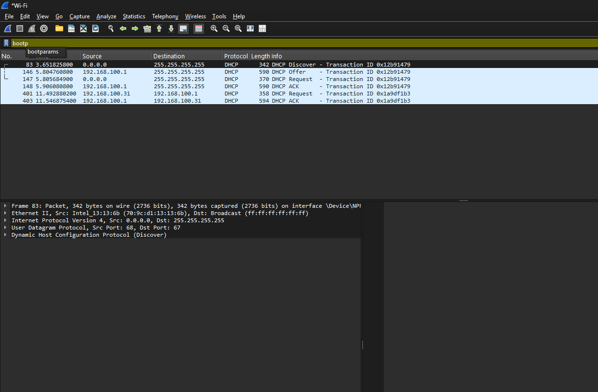
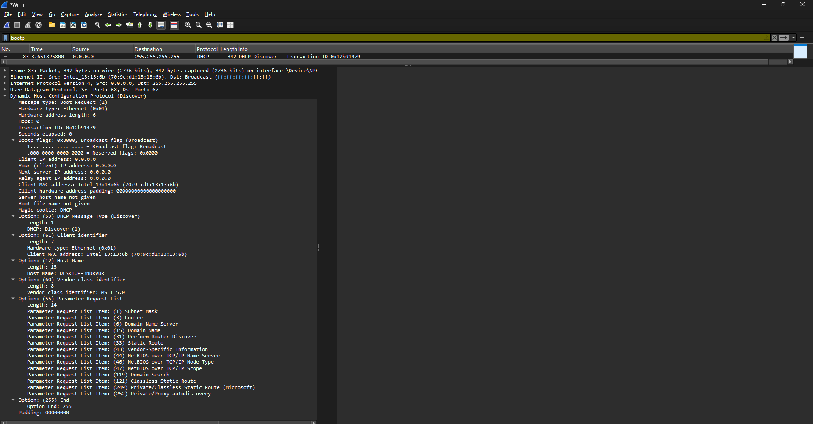
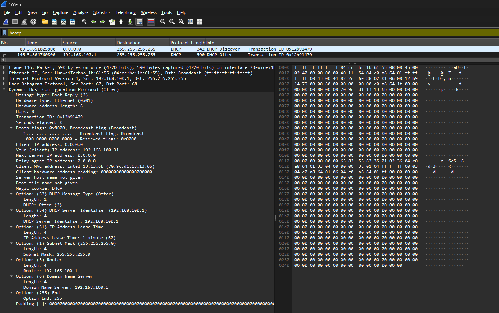
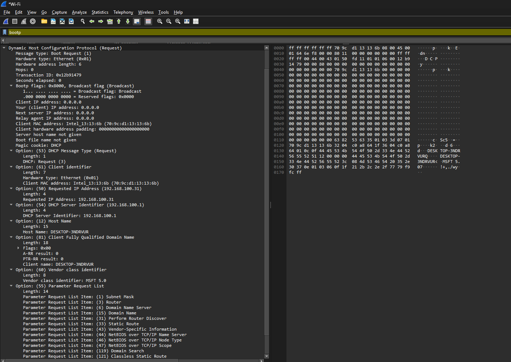
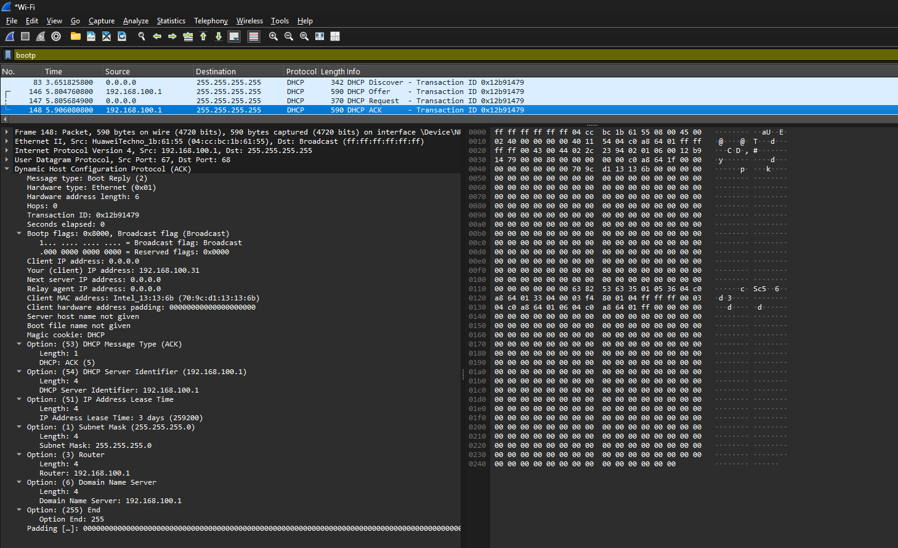

# Laporan Praktikum Jaringan Komputer - Modul 11
## Dynamic Host Configuration Protocol (DHCP)

### Identitas Praktikan
| Item | Keterangan |
|------|-----------|
| **Nama** | Muhammad Rohman Azizi |
| **NIM** | 103072400011 |
| **Kelas** | IF-04-01 |

---

## 1. Tujuan Praktikum
1. Menangkap dan menganalisis paket DHCP menggunakan Wireshark
2. Memahami proses DORA (Discover-Offer-Request-ACK)
3. Melihat konfigurasi jaringan yang diberikan DHCP server

---

## 2. Langkah Praktikum

**Yang dilakukan:**
1. Buka Command Prompt
2. Jalankan `ipconfig /release` (lepaskan IP)
3. Start Wireshark capture (pilih interface Wi-Fi)
4. Jalankan `ipconfig /renew` (minta IP baru)
5. Stop capture setelah IP muncul
6. Filter paket dengan `bootp`

---

## 3. Hasil Praktikum

### 3.1 Paket DHCP yang Berhasil Ditangkap

**Filter:** `bootp`



**Tabel Paket DHCP:**

| Frame | Waktu | Message Type | Source | Destination | Transaction ID |
|-------|-------|--------------|--------|-------------|----------------|
| 83 | 3.65s | DHCP Discover | 0.0.0.0 | 255.255.255.255 | 0x12b91479 |
| 146 | 5.80s | DHCP Offer | 192.168.100.1 | 255.255.255.255 | 0x12b91479 |
| 147 | 5.81s | DHCP Request | 0.0.0.0 | 255.255.255.255 | 0x12b91479 |
| 148 | 5.91s | DHCP ACK | 192.168.100.1 | 255.255.255.255 | 0x12b91479 |
| 401 | 11.49s | DHCP Request | 192.168.100.31 | 192.168.100.1 | 0x1a9df1b3 |
| 403 | 11.55s | DHCP ACK | 192.168.100.1 | 192.168.100.31 | 0x1a9df1b3 |

**Catatan:**
- Frames 83-148: Proses DORA awal (saat `ipconfig /renew`)
- Frames 401-403: DHCP Request & ACK berikutnya (renewal)
- Transaction ID **0x12b91479** sama untuk 4 paket pertama → satu sesi DHCP

---

### 3.2 DHCP Discover (Frame 83)



**Detail Paket:**
```
Message type: Boot Request (1) - Discover
Transaction ID: 0x12b91479
Client MAC address: Intel_13:13:13:6b (70:9c:d1:13:13:6b)
Client IP address: 0.0.0.0 (belum punya IP)

Options:
  (53) DHCP Message Type: Discover (1)
  (61) Client identifier
  (12) Host Name: DESKTOP-3NDRVUR
  (55) Parameter Request List:
    - Subnet Mask (1)
    - Router (3)
    - Domain Name Server (6)
    - Domain Name (15)
    - Dan 10 options lainnya...
```

**Yang terjadi:**
- Client broadcast cari DHCP server
- Client belum punya IP (0.0.0.0)
- Request konfigurasi: subnet mask, router, DNS, dll

---

### 3.3 DHCP Offer (Frame 146)



**Detail Paket:**
```
Message type: Boot Reply (2) - Offer
Transaction ID: 0x12b91479 (SAMA dengan Discover!)
Your (client) IP address: 192.168.100.31
Next server IP address: 192.168.100.1
Client MAC address: Intel_13:13:13:6b

Options:
  (53) DHCP Message Type: Offer (2)
  (54) DHCP Server Identifier: 192.168.100.1
  (51) IP Address Lease Time: 1 minute (60 seconds)
  (1) Subnet Mask: 255.255.255.0
  (3) Router: 192.168.100.1
  (6) Domain Name Server: 192.168.100.1
```

**Yang ditawarkan server:**
- **IP Address:** 192.168.100.31
- **Subnet Mask:** 255.255.255.0
- **Router/Gateway:** 192.168.100.1
- **DNS Server:** 192.168.100.1
- **Lease Time:** 60 detik (1 menit) ← sangat singkat!

---

### 3.4 DHCP Request (Frame 147)



**Detail Paket:**
```
Message type: Boot Request (3) - Request
Transaction ID: 0x12b91479
Client MAC address: Intel_13:13:13:6b

Options:
  (53) DHCP Message Type: Request (3)
  (50) Requested IP Address: 192.168.100.31
  (54) DHCP Server Identifier: 192.168.100.1
  (12) Host Name: DESKTOP-3NDRVUR
  (55) Parameter Request List:
    - Subnet Mask, Router, DNS, Domain Name, dll
```

**Yang dilakukan client:**
- Menerima tawaran server
- Request IP **192.168.100.31** secara formal
- Pilih server **192.168.100.1**

---

### 3.5 DHCP ACK (Frame 148)



**Detail Paket:**
```
Message type: Boot Reply (5) - ACK
Transaction ID: 0x12b91479
Your (client) IP address: 192.168.100.31
Next server IP address: 192.168.100.1

Options:
  (53) DHCP Message Type: ACK (5)
  (54) DHCP Server Identifier: 192.168.100.1
  (51) IP Address Lease Time: 3 days (259200 seconds)
  (1) Subnet Mask: 255.255.255.0
  (3) Router: 192.168.100.1
  (6) Domain Name Server: 192.168.100.1
```

**Konfirmasi server:**
- **IP final:** 192.168.100.31
- **Lease time:** 3 hari (259200 detik) ← berbeda dengan Offer!
- **Gateway & DNS:** 192.168.100.1

**Catatan menarik:**
- Offer: Lease time 1 menit
- ACK: Lease time 3 hari
- Server mungkin adjust lease time saat finalisasi

---

### 3.6 DHCP Renewal (Frames 401 & 403)

**Frame 401 - DHCP Request:**
```
Source: 192.168.100.31 (client sudah punya IP!)
Destination: 192.168.100.1 (unicast ke server)
Transaction ID: 0x1a9df1b3 (ID baru)
Message Type: Request
```

**Frame 403 - DHCP ACK:**
```
Source: 192.168.100.1
Destination: 192.168.100.31 (unicast)
Transaction ID: 0x1a9df1b3
Message Type: ACK
```

**Yang terjadi:**
- Client sudah punya IP (192.168.100.31)
- Renewal dilakukan via **unicast** (bukan broadcast)
- Transaction ID berbeda (0x1a9df1b3) → sesi baru

---

## 4. Analisis Praktikum

### 4.1 Proses DORA yang Teramati

```
Waktu 3.65s   : Client kirim DHCP Discover (broadcast)
Waktu 5.80s   : Server balas DHCP Offer (broadcast)
Waktu 5.81s   : Client kirim DHCP Request (broadcast)
Waktu 5.91s   : Server kirim DHCP ACK (broadcast)
─────────────────────────────────────────────────────
Total waktu   : ~2.26 detik (dari Discover ke ACK)

Waktu 11.49s  : Client kirim DHCP Request (unicast)
Waktu 11.55s  : Server balas DHCP ACK (unicast)
─────────────────────────────────────────────────────
Renewal time  : ~0.06 detik (lebih cepat!)
```

**Perbedaan:**
- **Initial DORA:** Broadcast, butuh 4 paket, ~2.26 detik
- **Renewal:** Unicast, cuma 2 paket (Request+ACK), ~0.06 detik

---

### 4.2 Konfigurasi Jaringan yang Diberikan

| Parameter | Nilai | Keterangan |
|-----------|-------|------------|
| **IP Address** | 192.168.100.31 | Alamat client |
| **Subnet Mask** | 255.255.255.0 | Network /24 |
| **Default Gateway** | 192.168.100.1 | Router untuk internet |
| **DNS Server** | 192.168.100.1 | DNS resolver |
| **Lease Time** | 3 hari (259200s) | Masa berlaku IP |
| **DHCP Server** | 192.168.100.1 | Server yang memberi IP |

**Network Information:**
- Network: 192.168.100.0/24
- Usable IPs: 192.168.100.1 - 192.168.100.254
- Gateway & DNS menggunakan IP yang sama (192.168.100.1)

---

### 4.3 Transaction ID Analysis

**Sesi 1 (Initial DORA):**
```
Frame 83  (Discover): Transaction ID = 0x12b91479
Frame 146 (Offer)   : Transaction ID = 0x12b91479 ✓
Frame 147 (Request) : Transaction ID = 0x12b91479 ✓
Frame 148 (ACK)     : Transaction ID = 0x12b91479 ✓
```

**Sesi 2 (Renewal):**
```
Frame 401 (Request): Transaction ID = 0x1a9df1b3
Frame 403 (ACK)    : Transaction ID = 0x1a9df1b3 ✓
```

**Kesimpulan:**
- Transaction ID sama dalam satu sesi DHCP
- Transaction ID berbeda untuk sesi yang berbeda
- Client generate random Transaction ID

---

### 4.4 Broadcast vs Unicast

**Initial DORA (Broadcast):**
```
Discover: 0.0.0.0 → 255.255.255.255 (client belum punya IP)
Offer:    192.168.100.1 → 255.255.255.255 (broadcast)
Request:  0.0.0.0 → 255.255.255.255 (broadcast)
ACK:      192.168.100.1 → 255.255.255.255 (broadcast)
```

**Renewal (Unicast):**
```
Request: 192.168.100.31 → 192.168.100.1 (unicast)
ACK:     192.168.100.1 → 192.168.100.31 (unicast)
```

**Mengapa berbeda?**
- Initial: Client belum punya IP → harus broadcast
- Renewal: Client sudah punya IP → bisa unicast ke server (lebih efisien)

---

### 4.5 Lease Time Analysis

**Dari Wireshark:**
- **Offer:** Lease time = 60 seconds (1 menit)
- **ACK:** Lease time = 259200 seconds (3 hari)

**Mengapa berbeda?**
1. Offer mungkin set lease time minimal sebagai "placeholder"
2. ACK finalisasi dengan lease time sebenarnya (3 hari)
3. Atau server adjust berdasarkan kebijakan

**Implikasi:**
- Client harus renew sebelum 3 hari
- T1 timer (50%): renew setelah 1.5 hari
- T2 timer (87.5%): broadcast renew setelah 2.625 hari

---

## 5. Kesimpulan

**Yang berhasil dilakukan:**

1. **Berhasil capture 4 paket DHCP** (Discover, Offer, Request, ACK) plus 2 paket renewal

2. **Proses DORA berjalan lengkap:**
   - Discover: Client cari server (broadcast)
   - Offer: Server tawarkan IP 192.168.100.31
   - Request: Client minta IP tersebut
   - ACK: Server konfirmasi, client dapat IP

3. **Transaction ID konsisten** (0x12b91479) untuk sesi initial DORA

4. **Konfigurasi jaringan berhasil didapatkan:**
   - IP: 192.168.100.31
   - Subnet Mask: 255.255.255.0
   - Gateway: 192.168.100.1
   - DNS: 192.168.100.1
   - Lease Time: 3 hari

5. **Terlihat perbedaan broadcast vs unicast:**
   - Initial DORA: broadcast (karena client belum punya IP)
   - Renewal: unicast (lebih cepat & efisien)

6. **Wireshark efektif** untuk analisis DHCP dengan filter `bootp`

**Temuan menarik:**
- Lease time di Offer (1 menit) berbeda dengan ACK (3 hari)
- Renewal jauh lebih cepat (0.06s vs 2.26s) karena unicast
- Gateway dan DNS menggunakan IP yang sama (192.168.100.1)