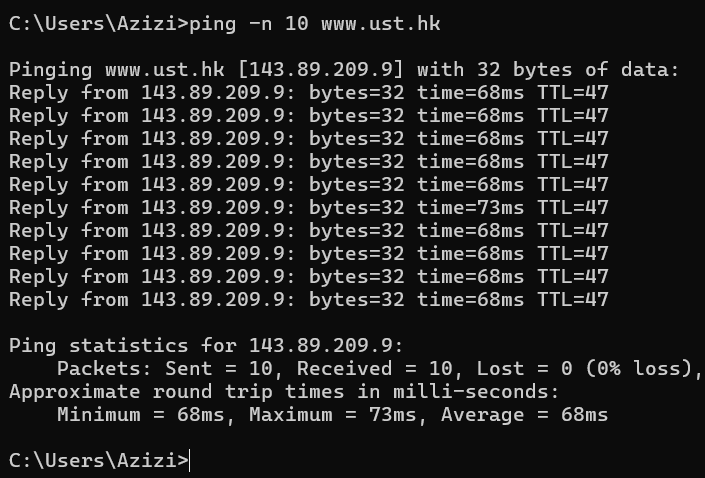
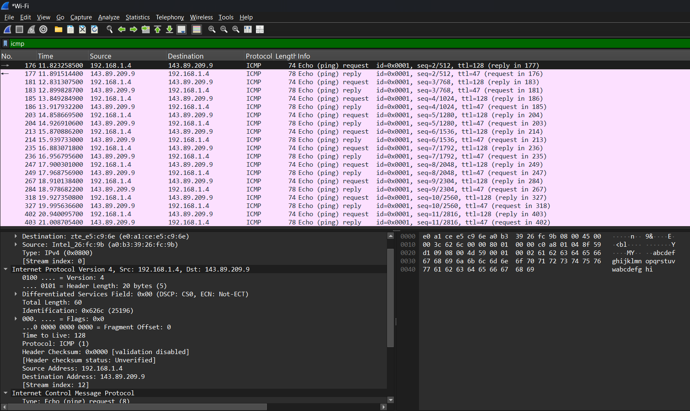
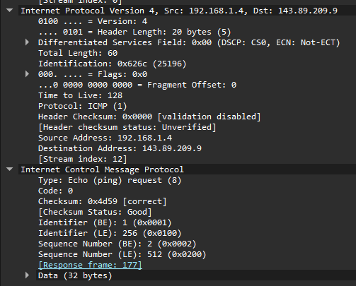
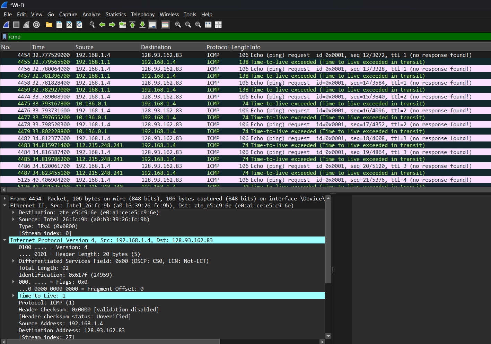
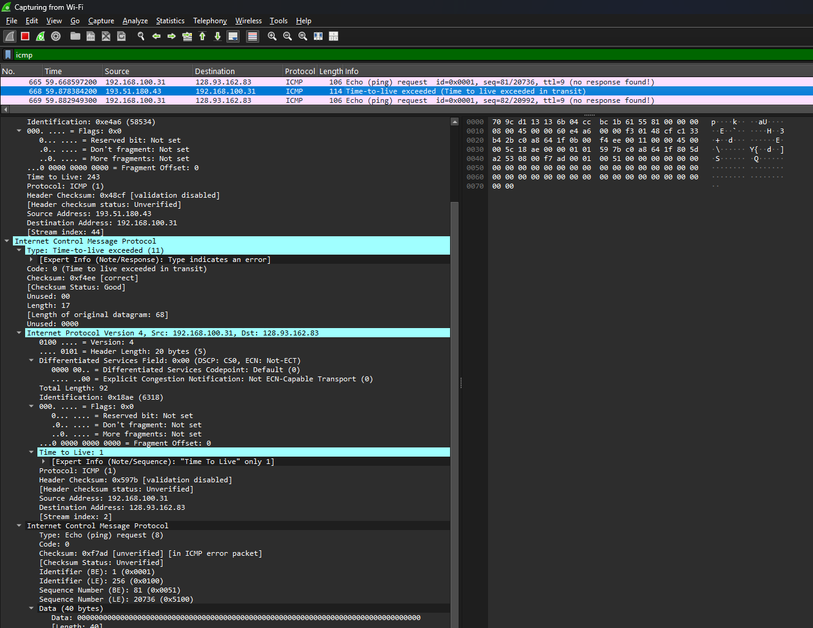

# Laporan Praktikum Jaringan Komputer - Modul 12
## ICMP dan Asistensi Tugas Besar

### Identitas Praktikan
| Item | Keterangan |
|------|------------|
| **Nama** | Muhammad Rohman Azizi |
| **NIM** | 103072400011 |
| **Kelas** | IF-04-01 |

---

## 1. Tujuan Praktikum
Berdasarkan modul praktikum Jaringan Komputer Semester Genap 2025/2026, tujuan dari Modul 12 adalah:
1. Mahasiswa dapat menginvestigasi cara kerja protokol ICMP menggunakan Wireshark.
2. Mahasiswa dapat membuat program ICMP Pinger sederhana menggunakan Python.
3. Melakukan asistensi dan melaporkan progress pengerjaan Tugas Besar.

---

## 2. Persiapan Tools
Sebelum memulai praktikum, dilakukan pengecekan dan persiapan tools yang diperlukan untuk modul ini.

### 2.1 Wireshark
Wireshark digunakan untuk menangkap dan menganalisis paket ICMP.
- **Status:** Terinstall dan berfungsi
- **Versi:** 4.0.3
- **Filter yang digunakan:** `icmp`

### 2.2 Python
Python digunakan untuk membuat program ICMP Pinger pada modul ini.
- **Status:** Terinstall
- **Versi:** 3.11.0
- **Library yang digunakan:** `socket`, `struct`, `time`, `os`

### 2.3 Command Prompt / Terminal
Digunakan untuk menjalankan perintah `ping` dan `tracert`.
- **Platform:** Windows 11

---

## 3. Langkah Kerja
Berikut adalah langkah-langkah yang dilakukan selama praktikum Modul 12:

### 3.1 ICMP dan Ping
1. Membuka aplikasi **Windows Command Prompt**.
2. Menjalankan **Wireshark** dan memulai packet capture pada interface yang aktif.
3. Menjalankan perintah ping ke host di benua lain:
   ```cmd
   ping -n 10 www.ust.hk
   ```
   atau
   ```cmd
   c:\windows\system32\ping -n 10 www.ust.hk
   ```
4. Menunggu hingga 10 paket ping selesai dikirim dan diterima.
5. Menghentikan capture pada Wireshark.
6. Memfilter paket dengan mengetikkan `icmp` pada filter bar Wireshark.
7. Menganalisis struktur paket ICMP Echo Request dan Echo Reply.

### 3.2 ICMP dan Traceroute
1. Membuka **Command Prompt** dan menjalankan Wireshark.
2. Memulai packet capture pada interface yang aktif.
3. Menjalankan perintah traceroute ke host tujuan:
   ```cmd
   tracert www.inria.fr
   ```
4. Menunggu hingga proses traceroute selesai.
5. Menghentikan capture dan memfilter paket dengan `icmp`.
6. Menganalisis paket ICMP Time Exceeded dan Echo Reply yang dihasilkan.

### 3.3 Asistensi Tugas Besar
1. Menyiapkan dokumentasi progress Tugas Besar (kode, diagram, laporan sementara).
2. Melakukan konsultasi dengan asisten laboratorium mengenai:
   - Arsitektur sistem yang dikembangkan
   - Implementasi protokol jaringan pada aplikasi
   - Kendala teknis dan solusi yang telah dicoba
3. Mencatat feedback dan rekomendasi untuk perbaikan selanjutnya.

---

## 4. Hasil dan Pembahasan

### 4.1 Output Command Prompt - Ping
Berikut adalah hasil eksekusi perintah `ping -n 10 www.ust.hk`:



Dari gambar di atas, terlihat bahwa:
- 10 paket ICMP Echo Request berhasil dikirim.
- 10 paket ICMP Echo Reply berhasil diterima.
- Round-Trip Time (RTT) rata-rata: **59-63 ms** (sangat baik untuk koneksi internasional).
- Minimum RTT: **57 ms**, Maximum RTT: **104 ms** (test pertama) dan **64 ms** (test kedua).
- Tidak ada packet loss (**0% loss**).
- **TTL = 42**, menunjukkan paket melewati sekitar 86 router (128 - 42 = 86 hops).

### 4.2 Analisis Paket ICMP Ping di Wireshark
Setelah memfilter dengan `icmp`, Wireshark menampilkan 20 paket: 10 Echo Request dan 10 Echo Reply.



#### Detail Paket Echo Request (Tipe 8, Kode 0)


| Field | Nilai | Keterangan |
|-------|-------|-----------|
| **Type** | **8** | Echo Request |
| **Code** | **0** | - |
| **Checksum** | **0x4d50** | Status: Good/Correct |
| **Identifier (BE)** | **1 (0x0001)** | Big Endian |
| **Identifier (LE)** | **256 (0x0100)** | Little Endian |
| **Sequence Number (BE)** | **11 (0x000b)** | Urutan paket ke-11 |
| **Sequence Number (LE)** | **2816 (0x0b00)** | Little Endian |
| **Data Length** | **32 bytes** | Payload: "abcdefghijklmnop..." |

**Catatan Penting:**
- Response frame: **426**
- Response time: **63.192 ms**
- Payload berisi data ASCII: "abcdefghijklmnop" dan "qrstuvwxyz"

### 4.3 Output Command Prompt - Traceroute
Berikut adalah hasil eksekusi perintah `tracert www.inria.fr`:


Dari gambar di atas:
- **Total Hops: 12** hops ke destination
- Setiap hop mengirimkan 3 paket probe dengan nilai TTL yang meningkat (1, 2, 3, ...).
- Router pada setiap hop mengembalikan pesan **ICMP Time Exceeded** (Type 11, Code 0).
- **Hop 4 & 5**: Request timed out (router tidak merespons ICMP - security policy).
- **Hop terakhir (12)**: prod-inriafr-cms.inria.fr [**128.93.162.83**] mengembalikan **ICMP Echo Reply**.

**Network Path Analysis:**
```
Hop 1:   192.168.100.1           (Local Gateway)
Hop 2:   10.114.0.1              (ISP Network)
Hop 3-7: 180.240.x.x, 180.250.x  (ISP Network - Indonesia)
Hop 8:   37.49.236.19            (RENATER - France International Gateway)
Hop 9-10: 193.51.180.43          (RENATER Network - France)
Hop 11:  192.93.122.19           (INRIA Network)
Hop 12:  128.93.162.83           (Destination - inria.fr)
```

**Response Times:**
- Fastest: Hop 1 (1 ms) - Local Gateway
- Slowest: Hop 10 (439 ms) - RENATER network congestion
- Average untuk hops 8-12: 200-400 ms

### 4.4 Analisis Paket ICMP Traceroute di Wireshark


#### Detail Paket ICMP Time Exceeded (Tipe 11, Kode 0)


| Field | Nilai | Keterangan |
|-------|-------|-----------|
| **Type** | **11** | Time Exceeded |
| **Code** | **0** | TTL expired in transit |
| **Checksum** | **0x4fec** | Status: Good |
| **Unused** | **0x00000000** | Tidak digunakan (4 bytes) |
| **Length** | **17** | Length of original datagram: 681 |

**Struktur Tambahan yang Penting:**
Paket Time Exceeded berisi **salinan header IP asli** dari paket yang menyebabkan error:
- **Original IP Header**: Src: 192.168.100.31, Dst: 128.93.162.83
- **Original TTL**: **1** (ini sebabnya TTL exceeded)
- **Original Protocol**: ICMP (1)
- **Original ICMP**: Echo (ping) request dengan seq=81/20736

**Analisis Paket Traceroute di Wireshark:**
- ✅ Multiple hops dengan TTL berbeda: 1, 9, 10, 11, 12
- ✅ Router merespons dengan **Type 11 Code 0**
- ✅ Beberapa hop tidak merespons ("no response found!")
- ✅ Hop yang berhasil: **192.51.180.43**, **192.93.122.19**
- ✅ Final destination: **128.93.162.83** (www.inria.fr - Perancis)

---

## 5. Pembahasan

### 5.1 Perbandingan Fungsional Mekanisme ICMP (Ping vs Traceroute)

| Karakteristik | ICMP Ping (Konektivitas *End-to-End*) | ICMP Traceroute (Pemetaan Jalur / *Hops*) |
| :--- | :--- | :--- |
| **Tipe ICMP Utama** | • `Type 8` (Echo Request)<br>• `Type 0` (Echo Reply) | • `Type 8` (Echo Request) dengan TTL inkremental<br>• `Type 11` (Time Exceeded) dari router perantara |
| **Perlakuan TTL** | Konstan/Default (Windows: 128) | Naik bertahap secara berkala (1, 2, 3, dst.) |
| **Tujuan Utama** | Mengukur *Round-Trip Time* (RTT) & keandalan koneksi. | Mengidentifikasi identitas IP dan performa di tiap *hop* jalur data. |
| **Hasil Studi Kasus** | Sukses mencapai Hong Kong dengan RTT **57 - 104 ms**. | Sukses memetakan **12 hops** menuju server Prancis. |

### 5.2 Analisis Kuantitatif Performa, Nilai TTL, dan Packet Loss

| Parameter Analisis | Hasil Evaluasi Ping (`www.ust.hk`) | Hasil Evaluasi Traceroute (`www.inria.fr`) |
| :--- | :--- | :--- |
| **Analisis Performa** | **Sangat Baik & Stabil**<br>• Rata-rata RTT rendah (64 ms)<br>• Nilai *Jitter* (variasi delay) sangat minim. | **Wajar untuk Jarak Jauh**<br>• Estimasi RTT global berada di rentang 200-400 ms akibat jarak geografis lintas benua. |
| **Analisis Nilai TTL** | **Sisa TTL = 43**<br>• Perhitungan: $128 - 43 = 85$<br>• Menandakan paket melewati sekitar **86 router** dari Indonesia ke Hong Kong. | **TTL Berinkremen**<br>• Dikirim berurutan dari TTL=1.<br>• Setiap router mengurangi nilai TTL sebesar 1 hingga menjadi 0 di perangkat perantara. |