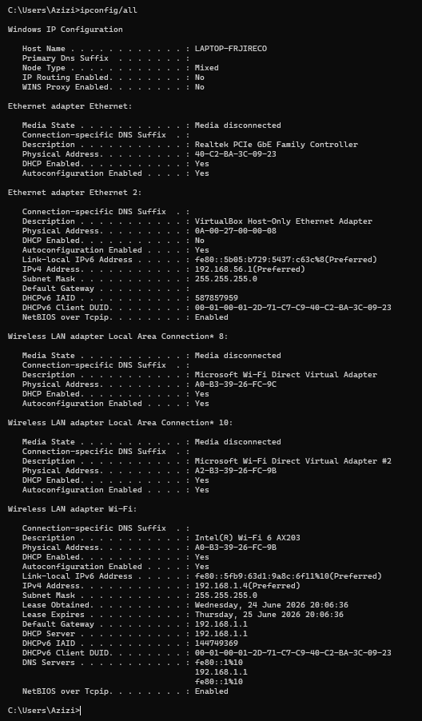
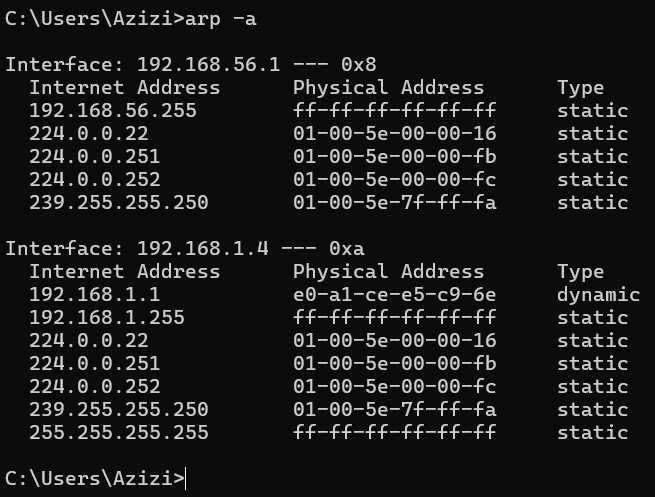
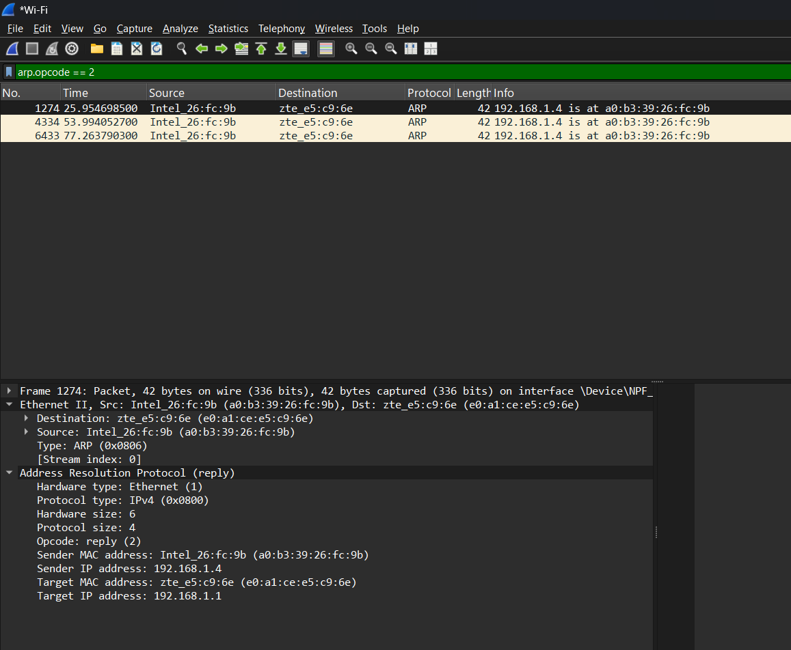
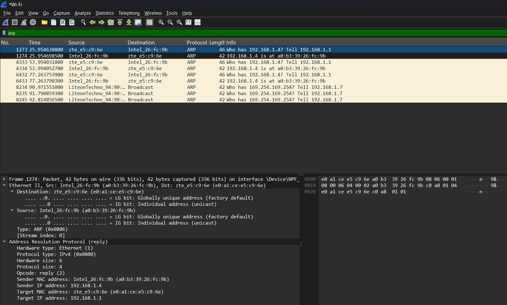
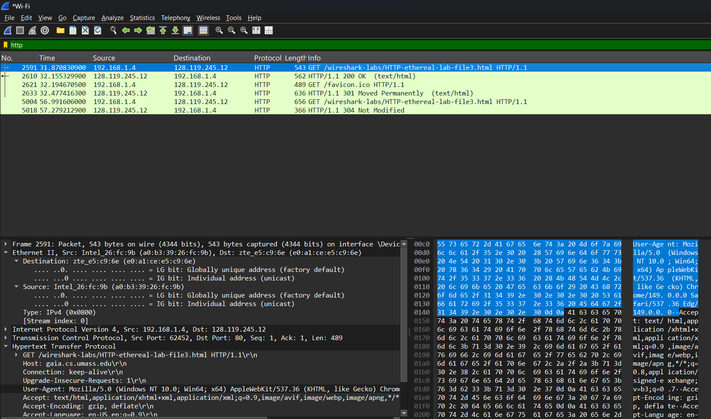
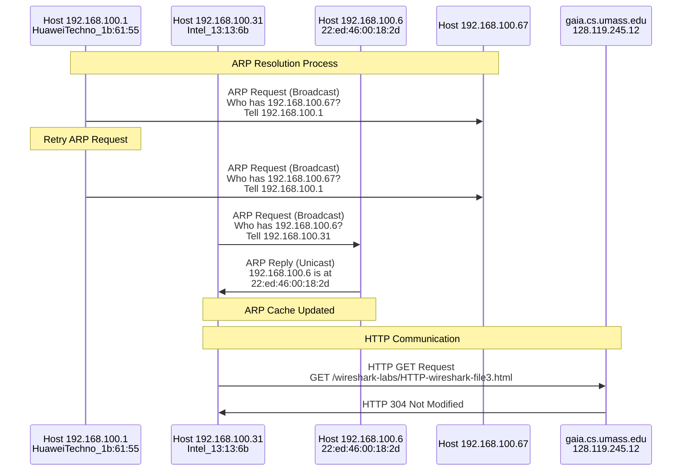

# Laporan Praktikum Jaringan Komputer - Modul 13

## Identitas Praktikan

| Item | Keterangan |
|------|------------|
| **Nama** | Muhammad Rohman Azizi |
| **NIM** | 103072400011 |
| **Kelas** | IF-04-01 |

---

## 1. Tujuan Praktikum

Modul 13 Praktikum Jaringan Komputer Semester Genap 2025/2026 memiliki tujuan sebagai berikut:

| No | Tujuan |
|:---:|:---|
| 1 | Mahasiswa mampu menginvestigasi cara kerja Ethernet dan ARP menggunakan Wireshark |
| 2 | Mahasiswa dapat menganalisis struktur frame Ethernet secara langsung |
| 3 | Mahasiswa memahami mekanisme kerja Address Resolution Protocol (ARP) |
| 4 | Mahasiswa mampu menganalisis ARP cache serta proses resolusi alamat |

---

## 2. Langkah Kerja

### 2.1 Persiapan dan Capture Frame Ethernet

1. Membuka Command Prompt dan menjalankan `ipconfig /all` untuk melihat konfigurasi jaringan
2. Membuka Wireshark dan memulai proses packet capture pada interface Wi-Fi
3. Mengakses URL: `http://gaia.cs.umass.edu/wireshark-labs/HTTP-ethereal-lab-file3.html`
4. Menghentikan capture setelah halaman berhasil dimuat
5. Menganalisis frame Ethernet yang tertangkap

### 2.2 Analisis ARP Cache

1. Membuka Command Prompt
2. Menjalankan perintah `arp -a` untuk melihat isi ARP cache
3. Mengamati entri dynamic dan static yang tersimpan
4. Mencatat informasi interface yang aktif beserta mapping IP-MAC-nya

### 2.3 Pengamatan Proses ARP

1. Memulai capture baru di Wireshark
2. Mengakses kembali URL yang sama agar proses ARP terpicu
3. Menggunakan filter `arp` untuk menampilkan seluruh traffic ARP
4. Menggunakan filter `arp.opcode == 2` untuk melihat ARP Reply secara spesifik
5. Menganalisis detail field pada paket ARP Request dan ARP Reply

---

## 3. Hasil dan Pembahasan

### 3.1 Konfigurasi Network Interface



*Gambar 1: Output perintah `ipconfig /all` pada host praktikan*

Berdasarkan output `ipconfig /all` yang ditampilkan, host dengan nama **LAPTOP-FRJIRECO** memiliki beberapa adapter jaringan yang terdeteksi:

| Parameter | Nilai |
|-----------|-------|
| **Host Name** | LAPTOP-FRJIRECO |
| **Adapter Aktif** | Wireless LAN adapter Wi-Fi |
| **Deskripsi** | Intel(R) Wi-Fi 6 AX203 |
| **Physical Address (MAC)** | A0-B3-39-26-FC-9B |
| **IPv4 Address** | 192.168.1.4 |
| **Subnet Mask** | 255.255.255.0 |
| **Default Gateway** | 192.168.1.1 |
| **DHCP Server** | 192.168.1.1 |
| **Lease Obtained** | Wednesday, 24 June 2026 20:06:36 |
| **Lease Expires** | Thursday, 25 June 2026 20:06:36 |

Adapter lain yang terdeteksi namun tidak aktif (Media disconnected):
- **Ethernet** — Realtek PCIe GBE Family Controller (MAC: 40-C2-BA-3C-09-23)
- **Ethernet 2** — VirtualBox Host-Only Ethernet Adapter (MAC: 0A-00-27-00-00-08), IP: 192.168.56.1
- **Wireless LAN Local Area Connection\* 8 & 10** — Microsoft Wi-Fi Direct Virtual Adapter

> Interface yang digunakan untuk capture adalah **Wi-Fi** dengan IP `192.168.1.4` dan MAC `a0:b3:39:26:fc:9b`.

---

### 3.2 ARP Cache



*Gambar 2: Hasil perintah `arp -a` yang menampilkan isi ARP cache table*

Terdapat dua interface yang terlihat pada output `arp -a`:

#### Interface 192.168.56.1 (Index 0x8) — VirtualBox Host-Only

| Internet Address | Physical Address | Type |
|-----------------|------------------|------|
| 192.168.56.255 | ff-ff-ff-ff-ff-ff | static |
| 224.0.0.22 | 01-00-5e-00-00-16 | static |
| 224.0.0.251 | 01-00-5e-00-00-fb | static |
| 224.0.0.252 | 01-00-5e-00-00-fc | static |
| 239.255.255.250 | 01-00-5e-7f-ff-fa | static |

#### Interface 192.168.1.4 (Index 0xa) — Wi-Fi Aktif

| Internet Address | Physical Address | Type |
|-----------------|------------------|------|
| 192.168.1.1 | e0-a1-ce-e5-c9-6e | **dynamic** |
| 192.168.1.255 | ff-ff-ff-ff-ff-ff | static |
| 224.0.0.22 | 01-00-5e-00-00-16 | static |
| 224.0.0.251 | 01-00-5e-00-00-fb | static |
| 224.0.0.252 | 01-00-5e-00-00-fc | static |
| 239.255.255.250 | 01-00-5e-7f-ff-fa | static |
| 255.255.255.255 | ff-ff-ff-ff-ff-ff | static |

**Analisis:**
- Hanya terdapat **satu entri dynamic** pada interface Wi-Fi aktif, yaitu default gateway `192.168.1.1` dengan MAC `e0:a1:ce:e5:c9:6e`. Entri ini terbentuk saat host melakukan komunikasi pertama kali melalui gateway.
- Semua entri lainnya bersifat **static**, mencakup alamat broadcast jaringan (`x.x.x.255`, `255.255.255.255`) dan alamat multicast (`224.x.x.x`, `239.255.255.250`) yang memang sudah dipetakan secara permanen ke MAC multicast/broadcast sesuai standar.
- Interface VirtualBox tidak memiliki entri dynamic karena tidak ada komunikasi aktif di segmen tersebut.

---

### 3.3 Analisis ARP Reply



*Gambar 3: Hasil filter `arp.opcode == 2` menampilkan paket ARP Reply*

Dengan filter `arp.opcode == 2`, Wireshark menampilkan tiga frame ARP Reply yang tercapture, semuanya berasal dari sumber yang sama:

| Frame No. | Time (s) | Source | Destination | Info |
|-----------|----------|--------|-------------|------|
| 1274 | 25.954698500 | Intel_26:fc:9b | zte_e5:c9:6e | 192.168.1.4 is at a0:b3:39:26:fc:9b |
| 4334 | 53.994052700 | Intel_26:fc:9b | zte_e5:c9:6e | 192.168.1.4 is at a0:b3:39:26:fc:9b |
| 6433 | 77.263790300 | Intel_26:fc:9b | zte_e5:c9:6e | 192.168.1.4 is at a0:b3:39:26:fc:9b |

#### Detail Frame 1274 (ARP Reply)

```
Ethernet II
  Source      : Intel_26:fc:9b  (a0:b3:39:26:fc:9b)
  Destination : zte_e5:c9:6e   (e0:a1:ce:e5:c9:6e)
  Type        : ARP (0x0806)
  Stream index: 0

Address Resolution Protocol (reply)
  Hardware type   : Ethernet (1)
  Protocol type   : IPv4 (0x0800)
  Hardware size   : 6
  Protocol size   : 4
  Opcode          : reply (2)
  Sender MAC      : a0:b3:39:26:fc:9b   ← MAC laptop praktikan
  Sender IP       : 192.168.1.4
  Target MAC      : e0:a1:ce:e5:c9:6e   ← MAC gateway/router
  Target IP       : 192.168.1.1
```

**Penjelasan:**
- ARP Reply dikirim secara **unicast** — langsung ke perangkat yang sebelumnya mengirim ARP Request, bukan broadcast.
- Host praktikan (`192.168.1.4`) menjawab pertanyaan dari router/gateway (`192.168.1.1`) dengan memberikan MAC address-nya.
- Pengiriman ARP Reply berulang tiga kali mengindikasikan bahwa gateway melakukan refresh ARP cache secara periodik untuk memverifikasi keberadaan host di jaringan.
- Tidak ada VLAN tagging pada frame ini, berbeda dengan skenario pada beberapa capture lainnya.

---

### 3.4 Analisis ARP Request



*Gambar 4: Hasil filter `arp` menampilkan keseluruhan traffic ARP*

Dengan filter `arp`, seluruh paket ARP Request dan Reply terlihat:

| Frame No. | Time (s) | Source | Destination | Info |
|-----------|----------|--------|-------------|------|
| 1273 | 25.954638800 | zte_e5:c9:6e | Intel_26:fc:9b | Who has 192.168.1.4? Tell 192.168.1.1 |
| 1274 | 25.954698500 | Intel_26:fc:9b | zte_e5:c9:6e | 192.168.1.4 is at a0:b3:39:26:fc:9b |
| 4333 | 53.994031800 | zte_e5:c9:6e | Intel_26:fc:9b | Who has 192.168.1.4? Tell 192.168.1.1 |
| 4334 | 53.994052700 | Intel_26:fc:9b | zte_e5:c9:6e | 192.168.1.4 is at a0:b3:39:26:fc:9b |
| 6432 | 77.263753900 | zte_e5:c9:6e | Intel_26:fc:9b | Who has 192.168.1.4? Tell 192.168.1.1 |
| 6433 | 77.263790300 | Intel_26:fc:9b | zte_e5:c9:6e | 192.168.1.4 is at a0:b3:39:26:fc:9b |
| 8231 | 90.971551000 | LiteonTechno_94:90:… | Broadcast | Who has 169.254.169.254? Tell 192.168.1.7 |
| 8234 | 91.790859300 | LiteonTechno_94:90:… | Broadcast | Who has 169.254.169.254? Tell 192.168.1.7 |
| 8245 | 92.814856500 | LiteonTechno_94:90:… | Broadcast | Who has 169.254.169.254? Tell 192.168.1.7 |

#### Detail Frame 1273 (ARP Request)

```
Ethernet II
  Source      : zte_e5:c9:6e   (e0:a1:ce:e5:c9:6e)   ← gateway/router
  Destination : Intel_26:fc:9b  (a0:b3:39:26:fc:9b)   ← unicast ke host
  Type        : ARP (0x0806)

Address Resolution Protocol (request)
  Opcode      : request (1)
  Sender MAC  : e0:a1:ce:e5:c9:6e
  Sender IP   : 192.168.1.1
  Target MAC  : 00:00:00:00:00:00   ← belum diketahui
  Target IP   : 192.168.1.4
```

> **Catatan menarik:** ARP Request dari gateway dikirim secara **unicast** (bukan broadcast) langsung ke MAC laptop. Hal ini terjadi karena gateway sudah mengetahui MAC address dari host sebelumnya (tersimpan di cache), sehingga memilih unicast ARP untuk efisiensi, mengurangi traffic broadcast di jaringan.

**Pola Traffic ARP:**
- Pola request-reply berulang setiap ~28 detik antara gateway (`192.168.1.1`) dan host (`192.168.1.4`) menunjukkan mekanisme **ARP keepalive** dari sisi router.
- Perangkat lain (`LiteonTechno`, IP `192.168.1.7`) mencoba meresolusi `169.254.169.254` — alamat ini digunakan untuk **AWS/cloud metadata service** atau link-local, namun tidak ada yang merespons (host tidak ditemukan di jaringan lokal).

---

### 3.5 Analisis HTTP over Ethernet



*Gambar 5: Frame 2591 berisi HTTP GET Request ke gaia.cs.umass.edu*

Wireshark dengan filter `http` menampilkan traffic HTTP yang berlangsung selama praktikum:

| Frame No. | Time (s) | Source | Destination | Info |
|-----------|----------|--------|-------------|------|
| 2591 | 31.870830900 | 192.168.1.4 | 128.119.245.12 | GET /wireshark-labs/HTTP-ethereal-lab-file3.html HTTP/1.1 |
| 2610 | 32.155329900 | 128.119.245.12 | 192.168.1.4 | HTTP/1.1 200 OK (text/html) |
| 2621 | 32.194670500 | 192.168.1.4 | 128.119.245.12 | GET /favicon.ico HTTP/1.1 |
| 2636 | 32.477416300 | 128.119.245.12 | 192.168.1.4 | HTTP/1.1 301 Moved Permanently (text/html) |
| 5004 | 56.991606000 | 192.168.1.4 | 128.119.245.12 | GET /wireshark-labs/HTTP-ethereal-lab-file3.html HTTP/1.1 |
| 5018 | 57.279212900 | 128.119.245.12 | 192.168.1.4 | HTTP/1.1 304 Not Modified |

#### Detail Frame 2591 — HTTP GET Request

```
Frame 2591: 543 bytes on wire (4344 bits), 543 bytes captured

├─ Ethernet II (Layer 2)
│    Source      : Intel_26:fc:9b  (a0:b3:39:26:fc:9b)
│    Destination : zte_e5:c9:6e   (e0:a1:ce:e5:c9:6e)
│    Type        : IPv4 (0x0800)
│    LG bit      : Globally unique address (factory default) — kedua sisi
│    IG bit      : Individual address (unicast) — kedua sisi
│
├─ Internet Protocol Version 4 (Layer 3)
│    Source      : 192.168.1.4
│    Destination : 128.119.245.12  (gaia.cs.umass.edu)
│    Stream index: 0
│
├─ Transmission Control Protocol (Layer 4)
│    Source Port : 62452
│    Dest Port   : 80 (HTTP)
│    Seq: 1, Ack: 1, Len: 489
│
└─ Hypertext Transfer Protocol (Layer 7)
     GET /wireshark-labs/HTTP-ethereal-lab-file3.html HTTP/1.1
     Host: gaia.cs.umass.edu
```

**Penjelasan:**
- Destination MAC pada frame ini adalah `e0:a1:ce:e5:c9:6e` milik gateway (`zte_e5:c9:6e`), bukan MAC server tujuan. Ini wajar karena host hanya mengetahui MAC gateway untuk pengiriman antar jaringan — proses ARP sebelumnya memastikan MAC gateway sudah tersedia di cache.
- Respons pertama server adalah **HTTP 200 OK** yang mengirimkan konten halaman.
- Pada request kedua (frame 5004), server merespons dengan **HTTP 304 Not Modified**, yang berarti konten tidak berubah sejak terakhir diunduh sehingga browser bisa menggunakan cache lokal.

---

### 3.6 Perbandingan ARP Request dan ARP Reply

| Aspek | ARP Request | ARP Reply |
|-------|-------------|-----------|
| **Opcode** | 1 | 2 |
| **Destination MAC (Ethernet)** | Unicast (dalam kasus ini) atau Broadcast | Unicast ke perangkat peminta |
| **Target MAC (ARP field)** | 00:00:00:00:00:00 (tidak diketahui) | Terisi dengan MAC address |
| **Arah pengiriman** | Satu ke satu atau satu ke semua | Point-to-point |
| **Tujuan** | Menanyakan siapa pemilik suatu IP | Memberitahu MAC address yang dimiliki |

---

### 3.7 Diagram Alur ARP dan HTTP



---

### 3.8 Struktur Frame Ethernet (Tanpa VLAN Tag)

Berdasarkan capture yang diperoleh, frame Ethernet yang digunakan tidak menggunakan VLAN tagging:

```
+──────────────────+──────────────────+──────────────────+
│ Destination MAC  │  Source MAC      │  EtherType       │
│   (6 bytes)      │   (6 bytes)      │  0x0800 (IPv4)   │
│                  │                  │  0x0806 (ARP)    │
+──────────────────+──────────────────+──────────────────+
│                   Payload (46–1500 bytes)               │
│         (ARP PDU atau IP Datagram)                      │
+─────────────────────────────────────────────────────────+
│               Frame Check Sequence / FCS                │
│                      (4 bytes)                          │
+─────────────────────────────────────────────────────────+
```

---

## 4. Kesimpulan

Dari keseluruhan praktikum yang telah dilakukan, diperoleh beberapa kesimpulan:

**Konfigurasi Jaringan Host**
Host dengan nama LAPTOP-FRJIRECO menggunakan adapter Intel Wi-Fi 6 AX203 dengan IP `192.168.1.4` dan MAC `a0:b3:39:26:fc:9b`. Gateway yang digunakan adalah `192.168.1.1` dengan MAC `e0:a1:ce:e5:c9:6e`.

**ARP Cache**
ARP cache terdiri dari entri dynamic (dipelajari melalui ARP) dan entri static (broadcast dan multicast yang sudah dipetakan secara permanen oleh sistem). Pada interface Wi-Fi yang aktif, hanya gateway yang memiliki entri dynamic, karena hanya gateway yang berkomunikasi langsung dengan host.

**Mekanisme ARP**
Gateway secara periodik mengirim ARP Request ke host untuk memperbarui cache-nya. Menariknya, request tersebut dikirim secara **unicast** (bukan broadcast) karena gateway sudah mengetahui MAC host dari sesi sebelumnya. Host menjawab dengan ARP Reply secara unicast yang memuat MAC address-nya.

**Protokol ARP**
ARP Request menggunakan opcode `1` dengan Target MAC diisi `00:00:00:00:00:00`, sedangkan ARP Reply menggunakan opcode `2` dengan seluruh field terisi lengkap. Kedua jenis paket menggunakan EtherType `0x0806`.

**HTTP over Ethernet**
Saat HTTP GET dikirim, destination MAC pada frame Ethernet adalah MAC gateway, bukan MAC server tujuan. Hal ini menunjukkan bahwa ARP hanya bekerja di jaringan lokal — untuk paket yang menuju internet, host cukup mengetahui MAC gateway. Server merespons dengan HTTP 200 pada request pertama dan HTTP 304 (Not Modified) pada request berikutnya karena konten tidak berubah.

---

## 5. Ringkasan Data Praktikum

| Informasi | Nilai |
|-----------|-------|
| Host | LAPTOP-FRJIRECO |
| IP Host | 192.168.1.4 |
| MAC Host | a0:b3:39:26:fc:9b |
| IP Gateway | 192.168.1.1 |
| MAC Gateway | e0:a1:ce:e5:c9:6e |
| Server HTTP | gaia.cs.umass.edu (128.119.245.12) |
| ARP Dynamic Entries | 1 (gateway saja) |
| ARP Static Entries | 6 (broadcast + multicast) |
| ARP Reply Frames | Frame 1274, 4334, 6433 |
| HTTP Request Pertama | Frame 2591 → HTTP 200 OK |
| HTTP Request Kedua | Frame 5004 → HTTP 304 Not Modified |
