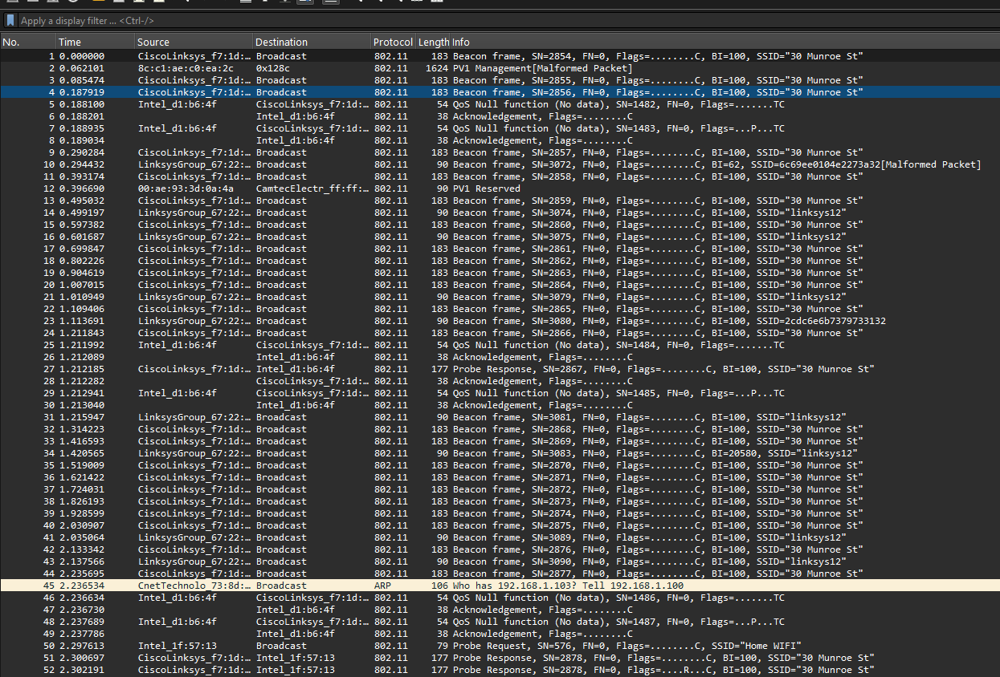
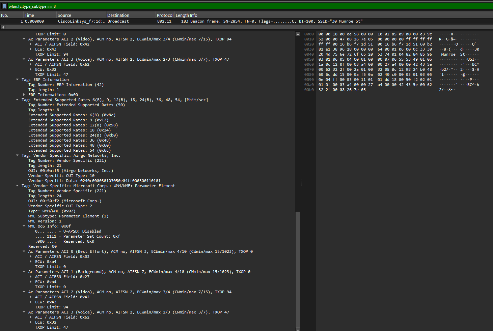
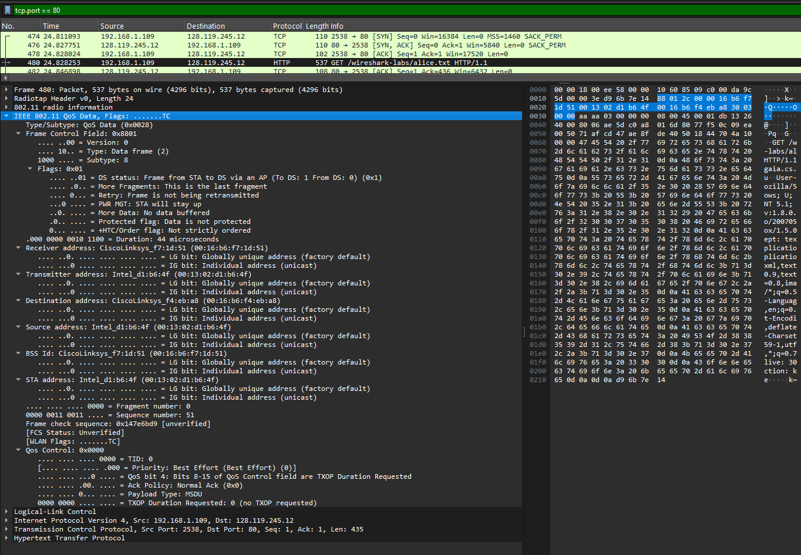
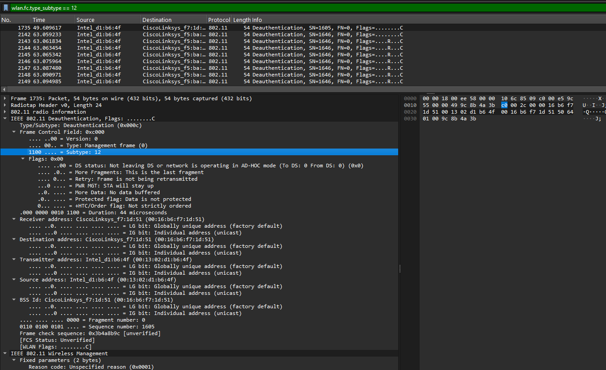
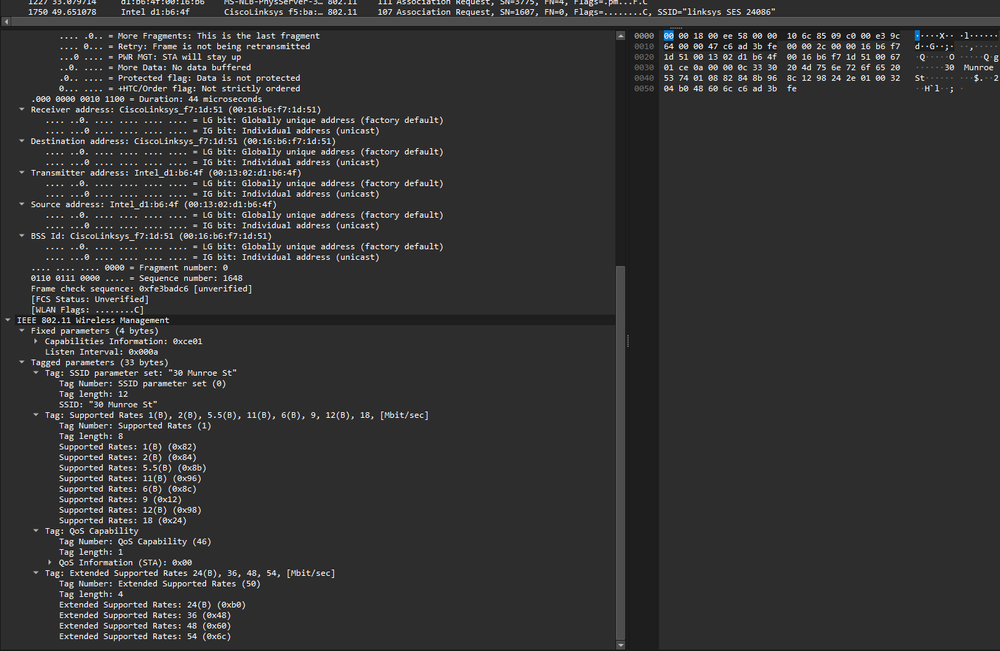

# Laporan Praktikum Jaringan Komputer - Modul 14
## Analisis Protokol IEEE 802.11 (WiFi)

### Identitas Praktikan

| Item      | Keterangan                |
| --------- | ------------------------- |
| **Nama**  | Ridho Bintang Adwitya |
| **NIM**   | 103072400015              |
| **Kelas** | IF-04-01                  |

---

# 1. Tujuan Praktikum

Berdasarkan Modul Praktikum Jaringan Komputer Semester Genap 2025/2026, tujuan praktikum ini adalah:

| No | Tujuan Praktikum |
| :---: | :--- |
| **1** | Mahasiswa dapat menginvestigasi cara kerja protokol WiFi 802.11 menggunakan Wireshark. |
| **2** | Mahasiswa mampu menganalisis struktur frame 802.11 (Beacon, Data, Management). |
| **3** | Mahasiswa memahami mekanisme asosiasi, disosiasi, dan transfer data pada jaringan nirkabel. |
| **4** | Mahasiswa dapat membedakan karakteristik frame 802.11 dengan frame Ethernet kabel. |

---

# 2. Langkah Kerja

## 2.1 Membuka File Capture

1. Mengunduh file `wireshark-traces.zip`.
2. Mengekstrak file `Wireshark_802_11.pcap`.
3. Membuka file tersebut menggunakan Wireshark.
4. Mengamati seluruh paket yang terdapat pada file capture.

## 2.2 Analisis Beacon Frame

1. Menggunakan filter:

```text
wlan.fc.type_subtype == 0x08
```

2. Memilih salah satu paket Beacon.
3. Mengamati informasi berikut:

* Timestamp
* Beacon Interval
* Capability Information
* SSID
* Supported Rates
* Channel

## 2.3 Analisis Transfer Data

1. Menggunakan filter:

```text
http
```

2. Menemukan paket HTTP yang dikirim melalui jaringan WiFi.
3. Menganalisis struktur frame IEEE 802.11 Data yang membawa payload HTTP.

## 2.4 Analisis Association dan Disassociation

1. Menggunakan filter:

```text
wlan.fc.type == 0
```

2. Mengidentifikasi frame Management.
3. Mengamati proses:

* Disassociation
* Probe Request
* Probe Response
* Association Request
* Association Response

---

# 3. Hasil dan Pembahasan

## 3.1 Tampilan Awal File Capture



**Gambar 1.** Tampilan file capture IEEE 802.11 pada Wireshark.

File capture memperlihatkan berbagai jenis frame IEEE 802.11 yang terdiri dari frame Management, Control, dan Data. Paket-paket tersebut digunakan untuk mendukung komunikasi antara klien dan Access Point pada jaringan WiFi.

---

## 3.2 Analisis Beacon Frame



**Gambar 2.** Detail Beacon Frame.

Beacon Frame merupakan frame Management yang dikirim secara periodik oleh Access Point untuk mengumumkan keberadaan jaringan nirkabel kepada perangkat di sekitarnya.

Informasi yang dapat diamati pada Beacon Frame antara lain:

| Field                  | Fungsi                              |
| ---------------------- | ----------------------------------- |
| Frame Control          | Menentukan tipe dan subtype frame   |
| Timestamp              | Penanda waktu sinkronisasi jaringan |
| Beacon Interval        | Interval pengiriman Beacon          |
| Capability Information | Informasi kemampuan jaringan        |
| SSID                   | Nama jaringan WiFi                  |
| Supported Rates        | Kecepatan transmisi yang didukung   |
| DS Parameter Set       | Channel yang digunakan              |

Berdasarkan hasil pengamatan, Access Point mengirimkan Beacon secara berkala untuk menginformasikan SSID, channel operasi, dan kemampuan jaringan kepada perangkat klien.

---

## 3.3 Analisis Transfer Data HTTP



**Gambar 3.** Frame Data IEEE 802.11 yang membawa paket HTTP.

Saat klien mengakses halaman web, paket HTTP dikirim melalui frame Data IEEE 802.11. Berbeda dengan Ethernet yang hanya memiliki alamat sumber dan tujuan, frame IEEE 802.11 dapat memiliki hingga empat alamat MAC.

### Struktur Alamat pada Frame Data

| Field     | Fungsi                                   |
| --------- | ---------------------------------------- |
| Address 1 | Receiver Address (RA)                    |
| Address 2 | Transmitter Address (TA)                 |
| Address 3 | BSSID                                    |
| Address 4 | Digunakan pada mode tertentu seperti WDS |

### Struktur Payload

```text
IEEE 802.11 Data Frame
├── MAC Header
├── LLC/SNAP Header
├── IP Header
├── TCP Header
└── HTTP Payload
```

Hasil pengamatan menunjukkan bahwa frame IEEE 802.11 tidak langsung membawa paket IP, melainkan melalui lapisan LLC/SNAP sebelum diteruskan ke protokol IP dan TCP.

---

## 3.4 Analisis Disassociation



**Gambar 4.** Frame Disassociation.

Pada waktu sekitar **49,58 detik**, klien mengirim frame Disassociation yang menunjukkan bahwa perangkat memutus hubungan dengan Access Point yang sedang digunakan.

Frame ini termasuk ke dalam kategori **Management Frame** dan berfungsi untuk mengakhiri hubungan asosiasi antara klien dan Access Point.

---

## 3.5 Analisis Association



**Gambar 5.** Urutan proses Association.

Setelah proses Disassociation, klien melakukan pencarian jaringan lain melalui mekanisme:

1. Probe Request
2. Probe Response
3. Association Request
4. Association Response

Pada waktu sekitar **63 detik**, klien kembali melakukan asosiasi ke Access Point **30 Munroe St** dan memperoleh respons sukses dari Access Point.

Proses Association memungkinkan perangkat klien memperoleh izin untuk bertukar data melalui jaringan WiFi yang dipilih.