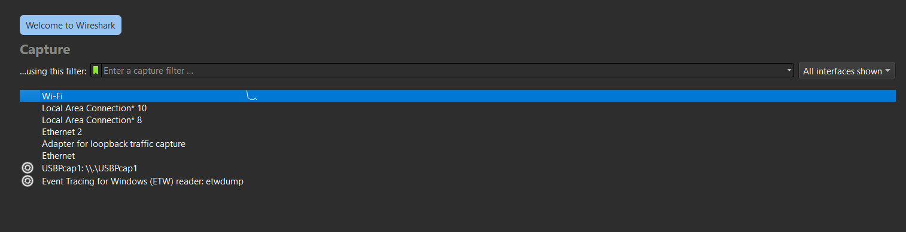
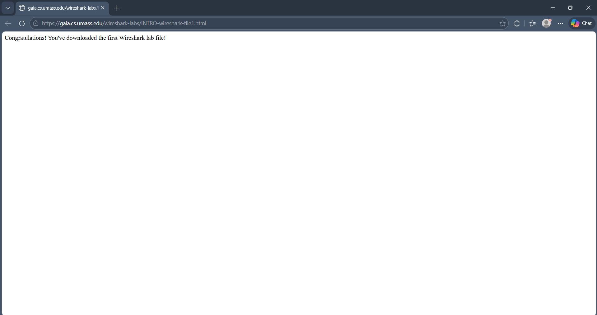
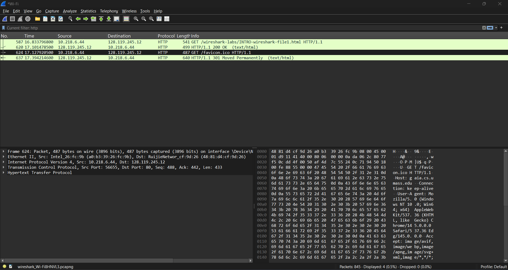

# Laporan Praktikum Jaringan Komputer - Minggu 2
## Modul 2: Pengenalan Tools

* **Nama:** Muhammad Rohman Azizi
* **NIM:** 103072400011
* **Jurusan:** Informatika
* **Fakultas:** Informatika
* **Universitas:** Universitas Telkom Surabaya
* **Tahun:** 2026
 
---

### 1. Tujuan Praktikum
Menggunakan Wireshark untuk melakukan *test run* (pengambilan paket jaringan) dan memahami cara kerja protokol jaringan dengan menganalisis lalu lintas HTTP.

### 2. Langkah-Langkah Pengambilan Paket (Packet Capture)
1. **Persiapan Antarmuka:** Memastikan komputer terhubung ke internet melalui antarmuka Ethernet kabel atau jaringan nirkabel (Wi-Fi).

2. **Membuka Wireshark:** Menjalankan aplikasi Wireshark. Untuk memulai, masuk ke menu dan pilih wifi, karena wifi jaringan yang sedang aktif. Lalu stelah memilih klik **start**.
* 

3. **Menghasilkan Lalu Lintas Jaringan:** Membuka *browser* web, disini contohnya mengakses URL berikut untuk memicu lalu lintas protokol HTTP:
   `http://gaia.cs.umass.edu/wireshark-labs/INTRO-wireshark-file1.html`
* 

5. **Menghentikan Capture:** Setelah halaman web berhasil dimuat, proses perekaman dihentikan dengan menekan ikon kotak merah pada antarmuka Wireshark.

### 3. Analisis dan Filter Paket
* **Kondisi Awal:** Wireshark akan menangkap banyak jenis paket lain dari berbagai protokol background yang berjalan di komputer.

* **Penerapan Filter:** Untuk mengisolasi data, digunakan spesifikasi filter tampilan. Diketikkan `http` pada kolom filter dan ditekan Enter. Ini membuat Wireshark hanya menampilkan pesan HTTP.
* 

* **Inspeksi Pesan HTTP GET:** Dicari dan dipilih paket pesan `HTTP GET` yang dikirim ke server.

* **Hierarki Protokol:** Melalui jendela detail paket (Packet Details), hierarki enkapsulasi data dapat diamati secara jelas dengan memaksimalkan informasi HTTP dan meminimalkan yang lain:
  * Pesan aplikasi Hypertext Transfer Protocol (HTTP)
  * Berada di dalam segmen Transmission Control Protocol (TCP)
  * Berada di dalam datagram Internet Protocol Version 4 (IPv4)
  * Berada di dalam bingkai (frame) Ethernet II / Wi-Fi

  ### 4. Kesimpulan
Praktikum Modul 1 dan 2 ini memberikan landasan operasional mengenai penggunaan perangkat lunak Wireshark serta verifikasi lingkungan Python dalam analisis jaringan. Melalui pengambilan paket data pada lalu lintas HTTP, dapat diamati bahwa setiap komunikasi aplikasi terintegrasi dalam struktur enkapsulasi yang sistematis.

Peninjauan secara hierarkis membuktikan bahwa pesan HTTP dikemas secara bertahap di dalam segmen TCP, datagram IPv4, hingga bingkai Ethernet. Secara keseluruhan, kegiatan ini berhasil memvisualisasikan teori jaringan menjadi pemahaman teknis mengenai cara kerja protokol komunikasi data dalam sebuah sistem yang aktif.