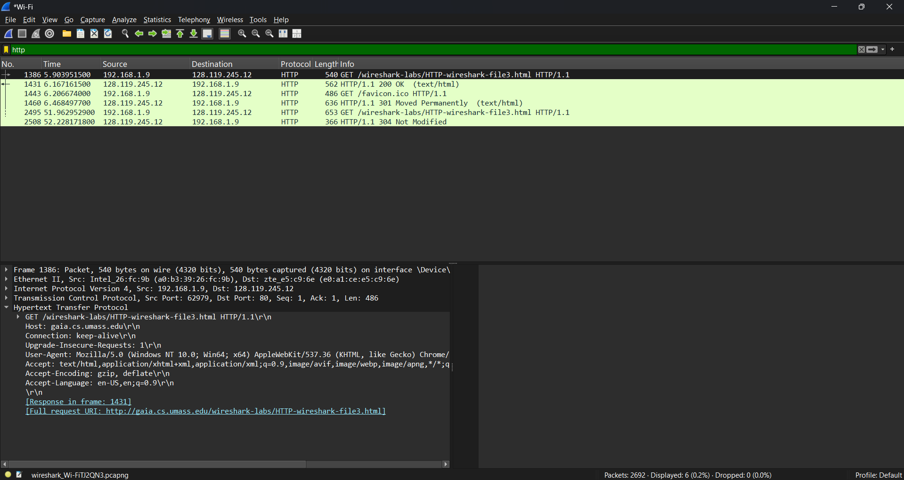
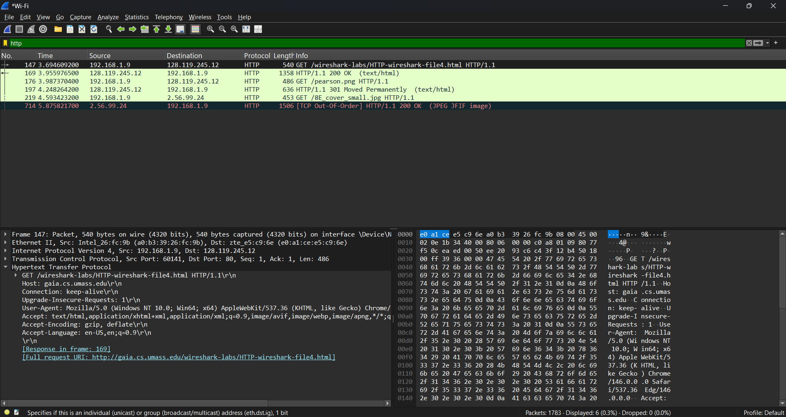
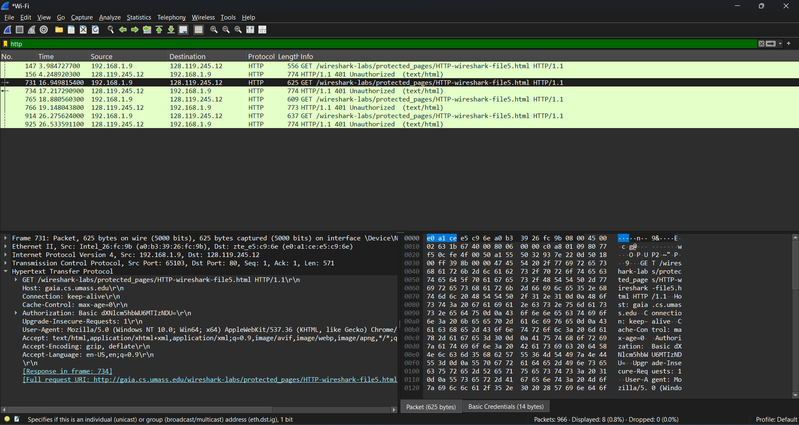

# Laporan Praktikum Jaringan Komputer - Minggu 3
## Modul 3: Analisis Protokol HTTP dengan Wireshark

* **Nama:** Muhammad Rohman Azizi
* **NIM:** 103072400011
* **Jurusan:** Informatika
* **Fakultas:** Informatika
* **Universitas:** Universitas Telkom Surabaya
* **Tahun:** 2026

---

### 1. Tujuan Praktikum
 * **Menganalisis cara kerja protokol HTTP menggunakan Wireshark.**

* **Mengamati interaksi dasar HTTP (GET, Response, Conditional GET, dll).**

* **Menunjukkan bagaimana TCP mendukung pengiriman data HTTP.**

* **Mengidentifikasi kelemahan autentikasi dasar HTTP.**

---

### 2. Landasan Teori
HTTP adalah protokol komunikasi berbasis teks yang berjalan di atas TCP/IP. Konsep penting yang diamati:

* **GET/Response: Permintaan dokumen dan balasan server.**

* **Conditional GET: Efisiensi cache dengan header If-Modified-Since.**

* **Dokumen Panjang: Dokumen besar dipecah menjadi segmen TCP.**

* **Embedded Objects: HTML memuat objek tambahan (gambar, CSS, JS).**

* **Authentication: Basic Auth mengirim kredensial dalam Base64.**

---

### 3. Langkah-Langkah
#### 3.1 Basic GET/Response
Akses: HTTP-wireshark-file1.html (http://gaia.cs.umass.edu/wireshark-labs/HTTP-wireshark-file1.html)

Bersihkan cache, jalankan Wireshark, amati paket GET.

#### 3.2 Conditional GET
Akses: HTTP-wireshark-file1.html (http://gaia.cs.umass.edu/wireshark-labs/HTTP-wireshark-file2.html) dua kali.

Perhatikan adanya header If-Modified-Since dan respons 304 Not Modified.

#### 3.3 Long Documents
Akses: HTTP-wireshark-file2.html (http://gaia.cs.umass.edu/wireshark-labs/HTTP-wireshark-file3.html).

Wireshark menampilkan TCP segment of a reassembled PDU.

#### 3.4 Embedded Objects
Akses: HTTP-wireshark-file3.html (http://gaia.cs.umass.edu/wireshark-labs/HTTP-wireshark-file4.html).

Analisis jumlah GET (HTML + gambar).

#### 3.5 Authentication
Akses: HTTP-wireshark-file4.html (http://gaia.cs.umass.edu/wireshark-labs/protected_pages/HTTP-wireshark-file5.html).

Masukkan username/password, amati header Authorization: Basic.

---

### 4. Hasil dan Analisa
#### 4.1 HTTP GET/Response
Pada percobaan pertama, diakses file HTML sederhana. Wireshark menangkap dua pesan utama: HTTP GET dari klien dan HTTP OK dari server.

Analisis:

* Request: Metode GET, Host gaia.cs.umass.edu.
* Response: Status Code 200 OK, Content-Type text/html.
* Protokol HTTP dibawa di atas segmen TCP, datagram IP, dan frame Ethernet.

#### 4.2 Conditional GET
Pada percobaan ini, halaman diakses dua kali. Akses kedua memanfaatkan cache browser.

Analisis:

* Pada request kedua, muncul header If-Modified-Since.
* Server merespons dengan status code 304 Not Modified, yang berarti browser tidak perlu mengunduh ulang konten karena tidak ada perubahan. Ini menghemat bandwidth.

#### 4.3 Long Documents
Mengakses dokumen "Bill of Rights" yang cukup panjang (sekitar 4500 byte).

Analisis:

* Respons HTTP tidak muat dalam satu paket TCP.
* Wireshark menampilkan keterangan "TCP segment of a reassembled PDU".
* Ini menunjukkan bahwa lapisan transportasi (TCP) memecah data besar menjadi segmen-segmen kecil sebelum dikirim.

#### 4.4 Embedded Objects
Mengakses halaman HTML yang mengandung dua gambar yang disimpan di server berbeda.

Analisis:

* Terlihat lebih dari satu request HTTP GET.
* Satu GET untuk file HTML utama.
* GET tambahan untuk mengambil objek gambar (embedded objects) yang direferensikan dalam HTML.
* Browser melakukan request secara paralel atau berurutan untuk setiap objek.

#### 4.5 Embedded Objects
Mengakses halaman yang dilindungi password.

Analisis:

* Request pertama ditolak server dengan status 401 Authorization Required.
* Client mengirim ulang GET dengan header Authorization: Basic.
* Kredensial (username dan password) di-encode menggunakan Base64.
* Keamanan: Base64 bukan enkripsi, melainkan encoding. Siapa saja yang menangkap paket dapat mendekode kembali username dan password menggunakan decoder Base64 online. Ini menunjukkan HTTP Basic Auth tidak aman tanpa HTTPS (SSL/TLS).

---

### 5. Kesimpulan
* HTTP bekerja dengan mekanisme request-response.

* Conditional GET meningkatkan efisiensi dengan cache.

* Dokumen besar dikirim melalui segmen TCP.

* Halaman dengan objek tertanam memicu banyak GET.

* Basic Authentication tidak aman tanpa SSL/TLS.