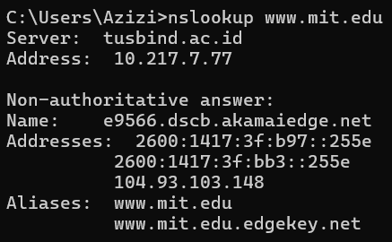
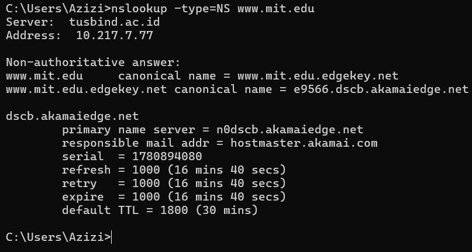
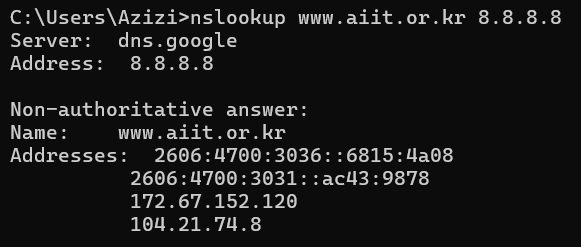
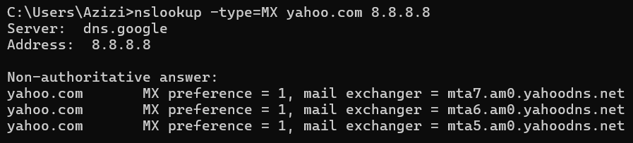
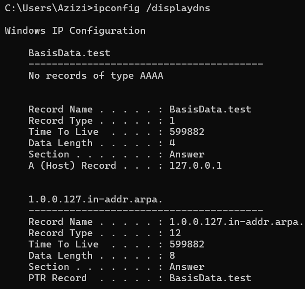
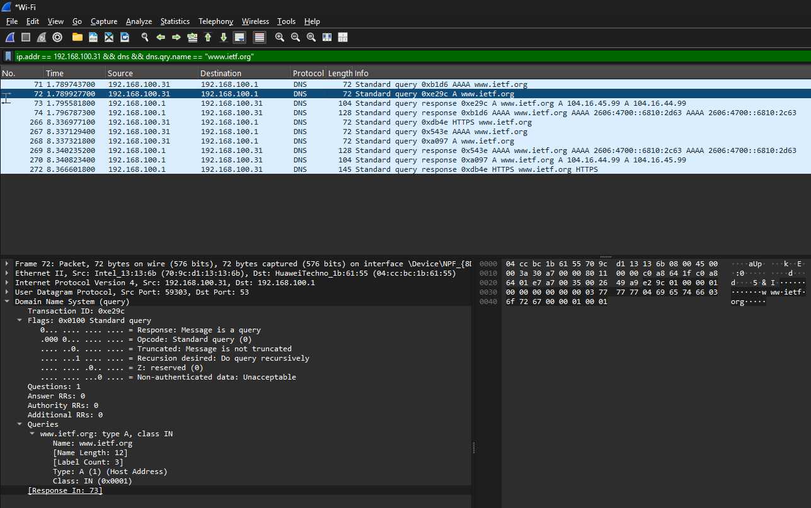
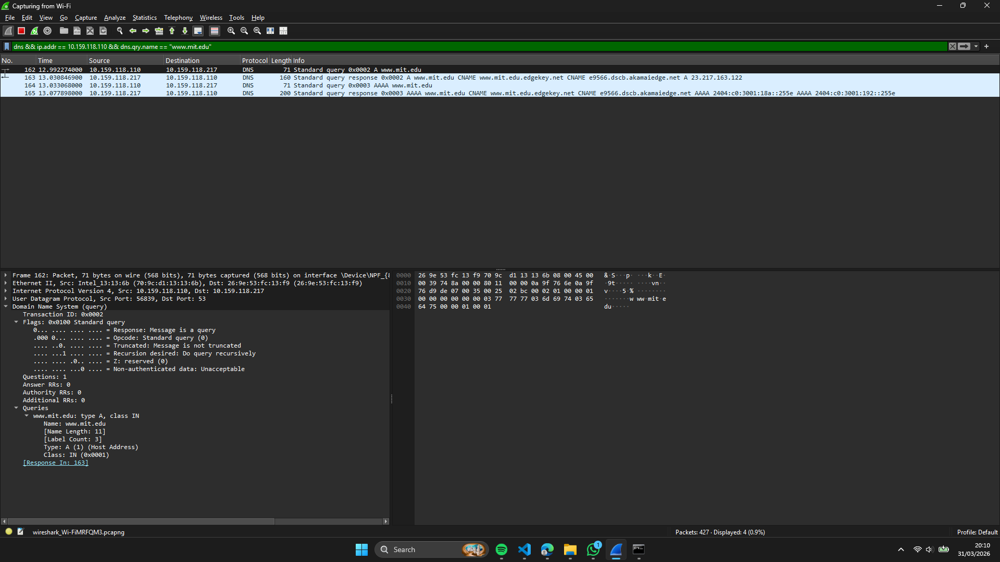

# Laporan Praktikum Jaringan Komputer - Modul 4
## Domain Name System (DNS)

### Identitas Praktikan
| Item | Keterangan |
|------|-----------|
| **Nama** | Muhammad Rohman Azizi |
| **NIM** | 103072400011|
| **Kelas** | IF-04-01 |

---

## 1 Tujuan Praktikum
| No | Tujuan | Penjelasan Sederhana |
|----|--------|---------------------|
| 1 | Memahami konsep DNS | Mengerti bagaimana nama website diubah jadi angka IP |
| 2 | Menggunakan nslookup | Bisa pakai perintah `nslookup` untuk cek DNS |
| 3 | Mengenal jenis record DNS | Tahu bedanya A, NS, MX, CNAME, dan fungsinya |
| 4 | Memahami hierarki DNS | Mengerti alur dari DNS lokal → root → TLD → server asli |
| 5 | Mengelola cache DNS | Bisa lihat dan hapus cache DNS pakai `ipconfig` |

---

## 2 Praktikum: Query DNS dengan nslookup

### 2.1 Query A Record (Basic Lookup)
```bash
nslookup www.mit.edu
```
**Hasil:**
```
Server:  10.159.118.217
Address: 10.159.118.217#53

Non-authoritative answer:
Name:    www.mit.edu
Address: 23.217.163.122
```


**Poin Penting:**
- DNS lokal (`10.159.118.217`) merespons query
- Jawaban bersifat *non-authoritative* (dari cache, bukan server otoritatif)
- Domain menggunakan CDN (Akamai) → IP adalah server edge

---

### 2.2 Query NS Record (Name Server)
```bash
nslookup -type=NS www.mit.edu
```
**Hasil:**
```
www.mit.edu   nameserver = usw2.akam.net
www.mit.edu   nameserver = usw4.akam.net
www.mit.edu   nameserver = asia1.akam.net
...
```


**Analisis:**
- Menampilkan daftar server DNS otoritatif untuk domain
- MIT menggunakan layanan Akamai untuk manajemen DNS

---

### 2.3 Query ke DNS Server Spesifik
```bash
nslookup www.aiit.or.kr 8.8.8.8
```
**Hasil:**
```
Server:  dns.google
Address: 8.8.8.8#53

Non-authoritative answer:
Name:    www.aiit.or.kr
Addresses:  172.67.152.120
            104.21.74.8
```


**Perbandingan DNS Lokal vs Publik:**
| Aspek | DNS Lokal (10.159.118.217) | DNS Publik (8.8.8.8) |
|-------|---------------------------|---------------------|
| Response Time | ~30-50 ms | ~250-300 ms |
| Sumber Data | Cache lokal / ISP | Global cache |
| Use Case | Jaringan kampus | Fallback / testing |

---

### 2.4 Query MX Record (Mail Server)
```bash
nslookup -type=MX yahoo.com 8.8.8.8
```
**Hasil:**
```
yahoo.com   mail exchanger = 1 mta7.am0.yahoodns.net
yahoo.com   mail exchanger = 1 mta6.am0.yahoodns.net
yahoo.com   mail exchanger = 1 mta5.am0.yahoodns.net
```


**Catatan:**
- Angka `1` = priority (semakin kecil, semakin diprioritaskan)
- Yahoo menggunakan multiple mail server untuk redundancy

---

## 3 Manajemen DNS Cache (Windows)

| Perintah | Fungsi | Output Singkat |
|----------|--------|---------------|
| `ipconfig /all` | Tampilkan konfigurasi jaringan lengkap | IP, Gateway, DNS Server |
| `ipconfig /displaydns` | Lihat cache DNS lokal | Daftar domain + TTL tersisa |
| `ipconfig /flushdns` | Hapus cache DNS | "Successfully flushed" |

**Contoh Output `displaydns`:**
```
Record Name . . . . . : www.google.com
Record Type . . . . . : 1 (A)
Time To Live . . . . : 245
Data Length . . . . . : 4
Section . . . . . . . : Answer
A (Host) Record . . . : 142.250.190.46
```


---

## 4 Analisis Paket DNS dengan Wireshark

### 4.1 Capture DNS Traffic (Akses www.ietf.org)
**Langkah:**
1. `ipconfig /flushdns` → bersihkan cache
2. Start Wireshark capture
3. Akses `http://www.ietf.org` di browser
4. Filter: `dns && ip.addr == 10.159.118.110`

**Hasil Capture:**


| Parameter | Query | Response |
|-----------|-------|----------|
| Protocol | UDP | UDP |
| Source Port | 54321 (ephemeral) | 53 |
| Dest Port | 53 | 54321 (ephemeral) |
| Query Type | A, AAAA | A, AAAA |
| Answer Count | 0 | 4 (2x IPv4 + 2x IPv6) |

**Jawaban DNS Response:**
```
Answers:
  www.ietf.org → 104.16.45.99   (A record)
  www.ietf.org → 104.16.44.99   (A record)
  www.ietf.org → 2606:4700::... (AAAA record)
  www.ietf.org → 2606:4700::... (AAAA record)
```

**Poin Analisis:**
- DNS menggunakan **UDP port 53** (bukan TCP)
- Multiple IP addresses → load balancing / redundancy
- Setelah DNS response, client kirim **TCP SYN** ke salah satu IP hasil resolusi
- Tidak perlu query ulang untuk setiap resource (gambar, CSS) karena ada **DNS cache + TTL**

---

### 4.2 Query www.mit.edu via Wireshark + nslookup
```bash
nslookup www.mit.edu
```
**Hasil Wireshark:**


**Proses Resolusi (CNAME Chaining):**
```
www.mit.edu 
   → CNAME: www.mit.edu.edgekey.net 
   → CNAME: e9566.dscb.akamaiedge.net 
   → A: 23.217.163.122
```

**Detail Response:**
| Record | Type | Value | TTL |
|--------|------|-------|-----|
| 1 | CNAME | www.mit.edu.edgekey.net | 1495s |
| 2 | CNAME | e9566.dscb.akamaiedge.net | 295s |
| 3 | A | 23.217.163.122 | 20s |

**Kesimpulan:**
- MIT menggunakan **Akamai CDN** → resolusi melalui beberapa CNAME sebelum dapat IP akhir
- TTL berbeda-beda per record → kontrol cache yang granular
- Response time: ~38 ms (DNS lokal)

---

### 4.3 Query www.aiit.or.kr ke DNS Publik (8.8.8.8)
```bash
nslookup www.aiit.or.kr 8.8.8.8
```
**Filter Wireshark:**
```
dns && ip.addr == 10.159.118.110 && dns.qry.name == "www.aiit.or.kr"
```

**Hasil:**
| Parameter | Nilai |
|-----------|-------|
| DNS Server | 8.8.8.8 (Google Public DNS) |
| Query Type | A (IPv4) + AAAA (IPv6) |
| Jawaban A | 172.67.152.120, 104.21.74.8 |
| TTL | 300 detik |
| Response Time | ~292 ms |

**Analisis:**
- IP termasuk range **Cloudflare** → domain pakai CDN
- Query ke DNS publik lebih lambat vs DNS lokal (karena jarak + hop)
- Dual-stack: support IPv4 & IPv6

---

## 5 Ringkasan Hasil Praktikum

| Parameter | Nilai / Keterangan |
|-----------|-------------------|
| Protokol DNS | UDP port 53 (umum), TCP untuk response >512 byte |
| Query Type yang diuji | A, AAAA, NS, MX |
| CNAME Chaining | Terjadi pada domain pakai CDN (MIT, aiit.or.kr) |
| Multiple IP per domain | Ya → load balancing / redundancy |
| DNS Cache | Berlaku sesuai TTL (detik-menit) |
| Response Time (lokal) | 30-50 ms |
| Response Time (publik) | 250-300 ms |
| Tools utama | `nslookup`, `ipconfig`, Wireshark |

---

## 6 Kesimpulan

| No | Poin Kesimpulan | Penjelasan Simpel |
|----|----------------|-------------------|
| 1 | DNS itu penting | Tanpa DNS, kita harus hafal angka IP tiap website |
| 2 | nslookup itu berguna | Tool simpel buat cek "IP dari domain X apa?" |
| 3 | DNS punya banyak jenis record | A untuk IP, NS untuk server resmi, MX untuk email, dll |
| 4 | DNS bekerja bertingkat | Dari cache → DNS lokal → root → TLD → server asli |
| 5 | DNS pakai UDP port 53 | Lebih cepat daripada TCP untuk query kecil |
| 6 | Satu domain bisa punya banyak IP | Untuk load balancing dan backup (redundancy) |
| 7 | CDN bikin DNS lebih kompleks | Domain bisa redirect ke server edge terdekat |
| 8 | Cache DNS menghemat waktu | Hasil query disimpan sementara (TTL) agar tidak tanya ulang |
| 9 | DNS publik vs lokal ada trade-off | Lokal cepat, publik stabil — pilih sesuai kebutuhan |
| 10 | Wireshark bantu "lihat" DNS | Bisa intip paket query/response secara real-time |