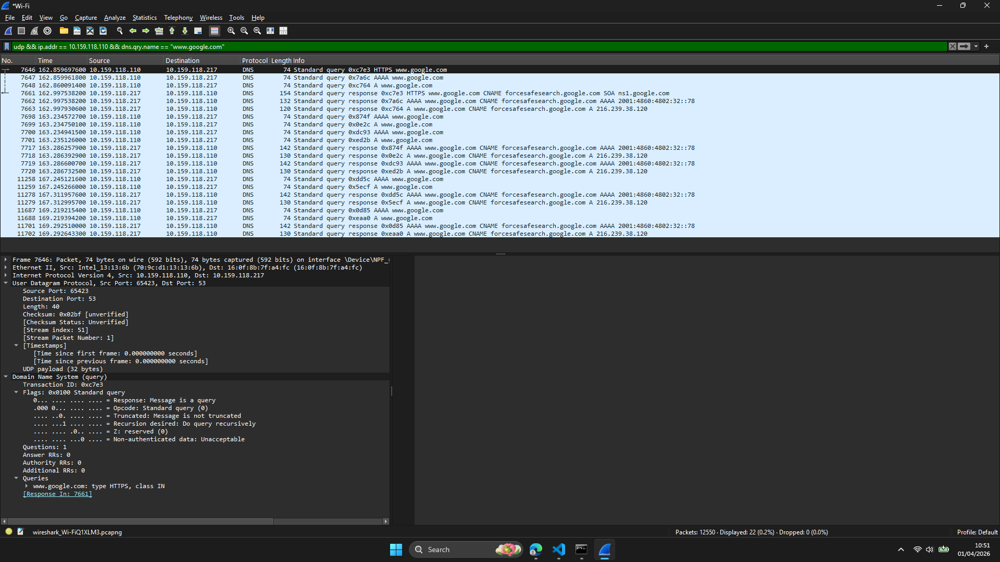
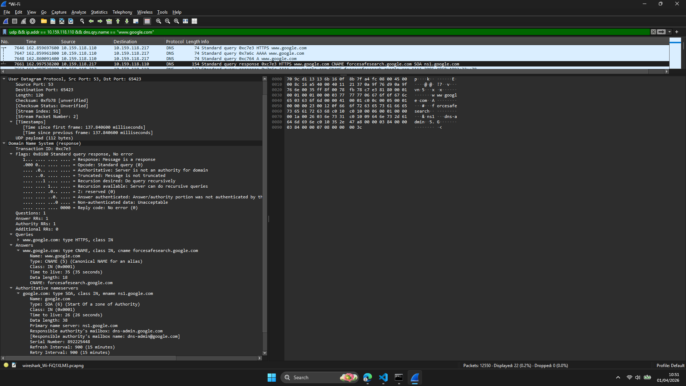

# Laporan Praktikum Jaringan Komputer - Modul 5
## User Datagram Protocol (UDP)

> **Semester Genap 2025/2026 | Fakultas Informatika | Universitas Telkom**

---

### Identitas Praktikan

| Keterangan | Informasi |
|------------|-----------|
| **Nama Lengkap** | Muhammad Rohman Azizi |
| **NIM** | 103072400011 |
| **Kelas** | IF-04-01 |

---

## 1. Tujuan Praktikum

| No | Tujuan | Penjelasan Sederhana |
|----|--------|---------------------|
| 1 | Investigasi cara kerja UDP | Mengerti bagaimana UDP kirim data tanpa "jabatan tangan" dulu |
| 2 | Identifikasi struktur header UDP | Tahu isi 4 field di header UDP dan fungsinya |
| 3 | Analisis port source-destination | Paham bagaimana port saling "balas" saat komunikasi |
| 4 | Hitung kapasitas payload UDP | Bisa hitung berapa maksimal data yang bisa dikirim UDP |

## 2 Langkah Kerja & Hasil

### 2.1 Capture Paket UDP
**Langkah:**
1. Buka Wireshark → pilih interface Wi-Fi → Start Capture
2. Jalankan perintah untuk memicu traffic UDP:
```bash
ipconfig /flushdns
nslookup google.com
```
3. Stop capture → terapkan filter:
```
udp && ip.addr == 10.159.118.110 && dns.qry.name == "www.google.com"
```

**Hasil Capture:**
| Frame | Type | Source Port | Dest Port | Length |
|-------|------|-------------|-----------|--------|
| 7646 | DNS Query | 65423 | 53 | 74 byte |
| 7661 | DNS Response | 53 | 65423 | 120 byte |

 | 

---

### 2.2 Analisis Header UDP

**Struktur Header (8 byte total):**
```
| Source Port (2B) | Dest Port (2B) | Length (2B) | Checksum (2B) |
```

**Hasil Analisis dari Wireshark:**

| Field | Query (Frame 7646) | Response (Frame 7661) |
|-------|-------------------|----------------------|
| Source Port | 65423 | 53 |
| Destination Port | 53 | 65423 |
| Length | 74 byte | 120 byte |
| Checksum | 0x02bf | 0xfb78 |

**Perhitungan Payload:**
- Query: 74 - 8 = **66 byte payload**
- Response: 120 - 8 = **112 byte payload**

---

### 2.3 Perhitungan Teknis UDP

| Parameter | Perhitungan | Hasil |
|-----------|-------------|-------|
| Maksimum Length (16-bit) | 2¹⁶ - 1 | 65.535 byte |
| Maksimum Payload | 65.535 - 8 | **65.527 byte** |
| Rentang Port | 0 - 2¹⁶ - 1 | **0 - 65.535** |
| Protocol Number (IP Header) | - | **17 (0x11)** |

> **Catatan:** Untuk menghindari fragmentasi IP pada Ethernet (MTU 1500), payload UDP disarankan ≤ **1472 byte** (1500 - 20 IP header - 8 UDP header).

---

### 2.4 Pola Komunikasi Request-Response UDP

#### 2.4.1 Mapping Port & IP

```
REQUEST:  10.159.118.110:65423 → 10.159.118.217:53
RESPONSE: 10.159.118.217:53    → 10.159.118.110:65423
```

#### 2.4.2 Poin Kunci Komunikasi UDP

| Konsep | Penjelasan | Contoh pada Praktikum |
|--------|-----------|---------------------|
| **Port Reversal** | Port source-destination dibalik saat response | Query: src=65423→dst=53 ; Response: src=53→dst=65423 |
| **Ephemeral Port** | Port sementara client (range dinamis) | Client pakai `65423` (masuk range 49152-65535) |
| **Well-Known Port** | Port standar layanan (0-1023) | DNS server selalu di port `53` |
| **Transaction ID** | ID unik untuk cocokkan query-response | DNS pakai ID `0xc7e3` sama di query & response |
| **Stateless** | Server tidak simpan "sesi" antar paket | Setiap query DNS independen, tidak ingat query sebelumnya |

---

## 3 Ringkasan Hasil

| Parameter | Nilai |
|-----------|-------|
| Jumlah field header UDP | 4 (Source Port, Dest Port, Length, Checksum) |
| Ukuran total header | 8 byte (fixed) |
| Payload query | 66 byte |
| Payload response | 112 byte |
| Maksimum payload teoritis | 65.527 byte |
| Maksimum payload praktis (Ethernet) | ~1472 byte |
| Rentang port | 0 - 65.535 |
| Protocol number UDP | 17 (0x11) |
| Pola port request-response | Dibalik (source ↔ destination) |

---

## 4 Kesimpulan

1. Header UDP hanya **8 byte** (4 field × 2 byte) → overhead kecil, cocok untuk aplikasi real-time.
2. Field **Length** mencakup header + payload; nilai pada capture: 74 byte (query) dan 120 byte (response).
3. Payload maksimum teoritis **65.527 byte**, tapi untuk Ethernet sebaiknya ≤ **1472 byte** agar tidak fragmentasi.
4. Port UDP range **0-65.535**; praktikum menggunakan port 53 (DNS server) dan 65423 (ephemeral client).
5. UDP menggunakan protocol number **17** pada IP header.
6. Pola komunikasi UDP: port source-destination **dibalik** pada response, dengan Transaction ID sama untuk matching.
7. Wireshark efektif untuk analisis langsung: lihat header, hitung payload, dan lacak alur request-response.