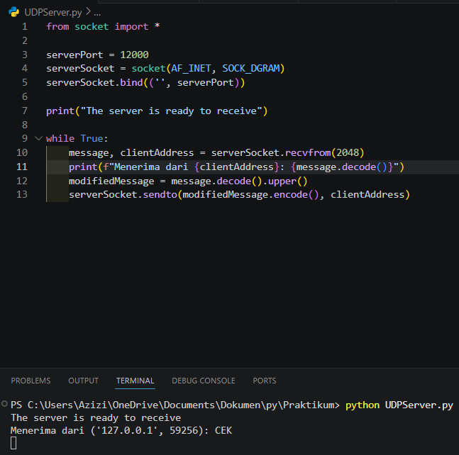
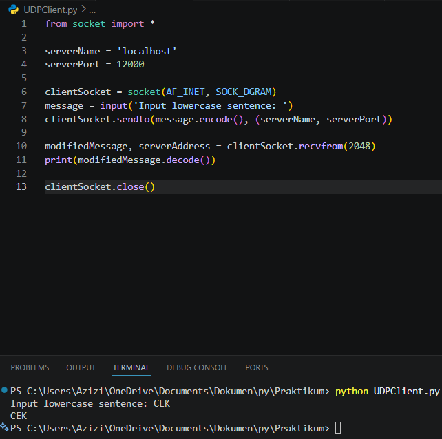
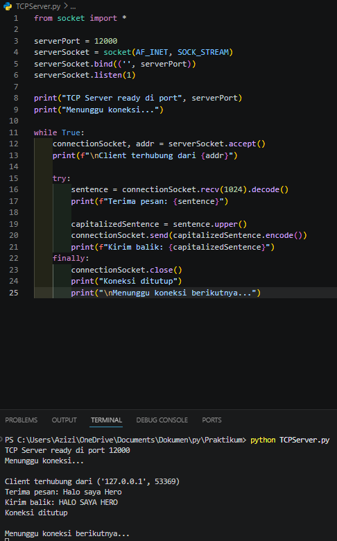
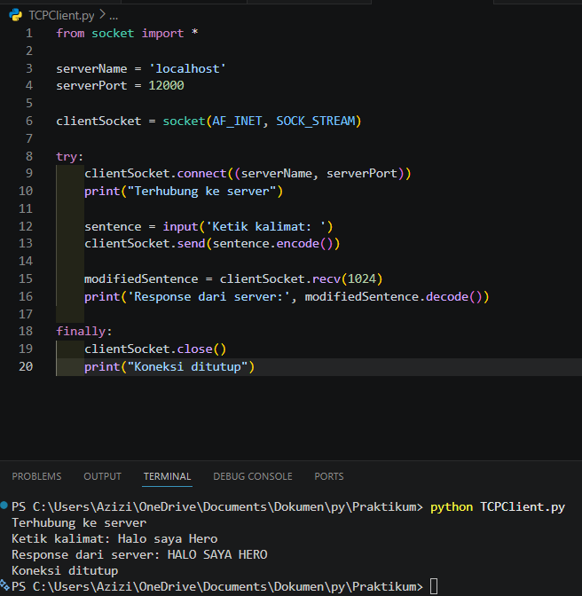

# Laporan Praktikum Jaringan Komputer - Modul 7
## Socket Programming: UDP dan TCP

### Identitas Praktikan
| Item | Keterangan |
|------|-----------|
| **Nama** | Muhammad Rohman Azizi|
| **NIM** | 103072400011 |
| **Kelas** | IF-04-01 |

---

## 1. Tujuan Praktikum
| No | Tujuan | Penjelasan |
|----|--------|-----------|
| 1 | Membuat aplikasi client-server UDP | Memahami implementasi socket UDP untuk komunikasi tanpa koneksi |
| 2 | Membuat aplikasi client-server TCP | Memahami implementasi socket TCP dengan mekanisme koneksi |
| 3 | Memahami perbedaan UDP dan TCP | Mengetahui karakteristik dan use case masing-masing protokol |
| 4 | Menganalisis pertukaran data | Mampu melacak alur komunikasi antara client dan server |

---

## 2. Praktikum UDP Socket

### 2.1 Kode Program UDP Server

**File:** `UDPServer.py`

```python
from socket import *

serverPort = 12000
serverSocket = socket(AF_INET, SOCK_DGRAM)
serverSocket.bind(('', serverPort))

print("The server is ready to receive")

while True:
    message, clientAddress = serverSocket.recvfrom(2048)
    modifiedMessage = message.decode().upper()
    serverSocket.sendto(modifiedMessage.encode(), clientAddress)
```

**Penjelasan:**
- Server membuat socket UDP dengan `SOCK_DGRAM`
- Bind ke port 12000
- Looping terus menerus untuk menerima pesan dari client
- Mengubah pesan menjadi uppercase dan mengirim balik

---

### 2.2 Kode Program UDP Client

**File:** `UDPClient.py`

```python
from socket import *

serverName = 'localhost'
serverPort = 12000

clientSocket = socket(AF_INET, SOCK_DGRAM)
message = input('Input lowercase sentence: ')
clientSocket.sendto(message.encode(), (serverName, serverPort))

modifiedMessage, serverAddress = clientSocket.recvfrom(2048)
print(modifiedMessage.decode())

clientSocket.close()
```

**Penjelasan:**
- Client membuat socket UDP (tidak perlu bind port)
- Langsung kirim pesan ke server dengan `sendto()`
- Terima response dengan `recvfrom()`
- Tidak perlu `connect()` karena UDP connectionless

---

### 2.3 Hasil Eksekusi UDP

**Langkah Testing:**
1. Buka terminal 1 → jalankan server
2. Buka terminal 2 → jalankan client
3. Input pesan dan lihat hasilnya

**Terminal 1 - UDP Server:**


Server berjalan dan menunggu pesan dari client.

**Terminal 2 - UDP Client:**


Client mengirim pesan dan menerima response dari server.

**Hasil:**
- Input: `Cek`
- Output dari server: `CEK`
- Pesan berhasil dikonversi ke uppercase

---

## 3. Praktikum TCP Socket

### 3.1 Kode Program TCP Server

**File:** `TCPServer.py`

```python
from socket import *

serverPort = 12000
serverSocket = socket(AF_INET, SOCK_STREAM)
serverSocket.bind(('', serverPort))
serverSocket.listen(1)

print('The server is ready to receive')

while True:
    connectionSocket, addr = serverSocket.accept()
    sentence = connectionSocket.recv(1024).decode()
    capitalizedSentence = sentence.upper()
    connectionSocket.send(capitalizedSentence.encode())
    connectionSocket.close()
```

**Penjelasan:**
- Server membuat socket TCP dengan `SOCK_STREAM`
- `listen(1)` → siap menerima koneksi (max 1 antrian)
- `accept()` → terima koneksi dari client, buat `connectionSocket` baru
- Setelah selesai, `connectionSocket.close()` (serverSocket tetap terbuka)

---

### 3.2 Kode Program TCP Client

**File:** `TCPClient.py`

```python
from socket import *

serverName = 'localhost'
serverPort = 12000

clientSocket = socket(AF_INET, SOCK_STREAM)
clientSocket.connect((serverName, serverPort))

sentence = input('Input lowercase sentence: ')
clientSocket.send(sentence.encode())

modifiedSentence = clientSocket.recv(1024)
print('From Server:', modifiedSentence.decode())

clientSocket.close()
```

**Penjelasan:**
- Client membuat socket TCP
- `connect()` → inisiasi koneksi (3-way handshake)
- Kirim data dengan `send()` (tidak perlu alamat tujuan)
- Terima response dengan `recv()`

---

### 3.3 Hasil Eksekusi TCP

**Langkah Testing:**
1. Buka terminal 1 → jalankan TCP server
2. Buka terminal 2 → jalankan TCP client
3. Input kalimat dan lihat hasilnya

**Terminal 1 - TCP Server:**


Server siap menerima koneksi dan memproses pesan dari client.

**Terminal 2 - TCP Client:**


Client terhubung ke server, mengirim pesan, dan menerima response.

**Hasil:**
- Input: `Halo saya Hero`
- Output dari server: `HALO SAYA HERO`
- Koneksi TCP established sebelum transfer data

---

## 4. Perbandingan UDP vs TCP (Hasil Praktikum)

### 4.1 Perbedaan Implementasi

| Aspek | UDP | TCP |
|-------|-----|-----|
| **Socket Type** | `SOCK_DGRAM` | `SOCK_STREAM` |
| **Koneksi** | Tidak perlu `connect()` | Perlu `connect()` |
| **Server Socket** | 1 socket untuk semua client | 2 socket (serverSocket + connectionSocket) |
| **Send/Receive** | `sendto()` / `recvfrom()` | `send()` / `recv()` |
| **Address** | Harus specify alamat | Otomatis (sudah ada koneksi) |

---

### 4.2 Perbedaan Hasil Eksekusi

| Karakteristik | UDP | TCP |
|--------------|-----|-----|
| **Kecepatan** | Lebih cepat (langsung kirim) | Ada delay handshake |
| **Server** | Handle multiple client simultan | Handle 1 client per waktu |
| **Client** | Bisa kirim berkali-kali | Kirim 1x, koneksi selesai |
| **Reliability** | Tidak ada jaminan | Data terjamin sampai |

---

## 5. Analisis Praktikum

### 5.1 UDP Socket

**Hasil Pengamatan:**
- Server bisa menerima pesan dari berbagai client
- Tidak ada proses koneksi yang terlihat
- Pesan langsung dikirim dan diterima
- Tidak ada konfirmasi delivery

**Keunggulan UDP:**
- Implementasi sederhana
- Tidak ada overhead koneksi
- Cocok untuk aplikasi real-time

**Keterbatasan:**
- Tidak ada jaminan pesan sampai
- Tidak ada urutan data
- Tidak ada retransmisi

---

### 5.2 TCP Socket

**Hasil Pengamatan:**
- Ada proses `connect()` sebelum kirim data
- Server membuat socket khusus untuk setiap client
- Data terjamin sampai dan berurutan
- Koneksi ditutup setelah selesai

**Keunggulan TCP:**
- Reliable delivery
- Data terurut
- Flow control & congestion control

**Keterbatasan:**
- Overhead lebih besar
- Ada delay handshake
- Lebih kompleks

---

## 6. Testing Tambahan

### 6.1 Multiple Clients (UDP)

**Test:** Jalankan beberapa client secara bersamaan

**Hasil:**
- UDP server bisa handle multiple clients
- Semua client menggunakan socket yang sama
- Pesan diproses satu per satu dalam loop

---

### 6.2 Multiple Clients (TCP)

**Test:** Coba connect beberapa client

**Hasil:**
- TCP server handle client secara sequential
- Client kedua harus tunggu client pertama selesai
- Setiap client dapat `connectionSocket` terpisah

**Catatan:** Untuk handle concurrent clients, perlu implementasi threading.

---

## 7. Kesimpulan

Berdasarkan praktikum yang telah dilakukan:

1. **UDP Socket:**
   - Lebih sederhana implementasinya
   - Connectionless (tidak perlu handshake)
   - Cocok untuk aplikasi yang mengutamakan kecepatan
   - Tidak ada jaminan delivery

2. **TCP Socket:**
   - Lebih kompleks tapi reliable
   - Connection-oriented (perlu 3-way handshake)
   - Data terjamin sampai dan berurutan
   - Cocok untuk aplikasi yang butuh keandalan

3. **Perbedaan Utama:**
   - UDP: `sendto()`/`recvfrom()`, 1 socket server
   - TCP: `send()`/`recv()`, 2 socket server
   - TCP perlu `connect()`/`listen()`/`accept()`

4. **Pemilihan Protokol:**
   - **UDP** untuk: DNS, streaming, VoIP, gaming
   - **TCP** untuk: Web, email, file transfer

5. **Socket programming** memberikan kontrol penuh terhadap komunikasi jaringan di application layer.