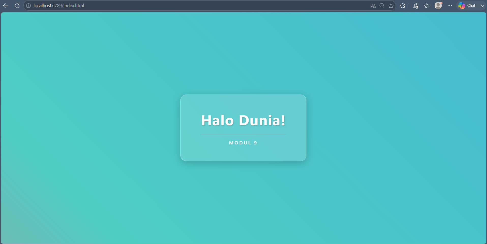
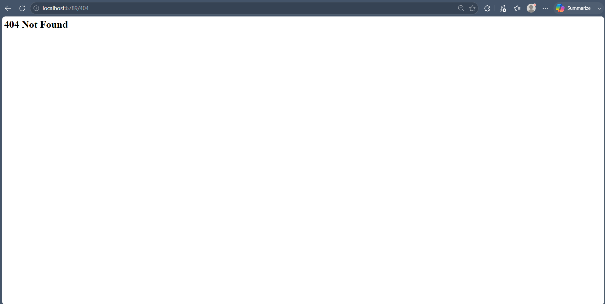
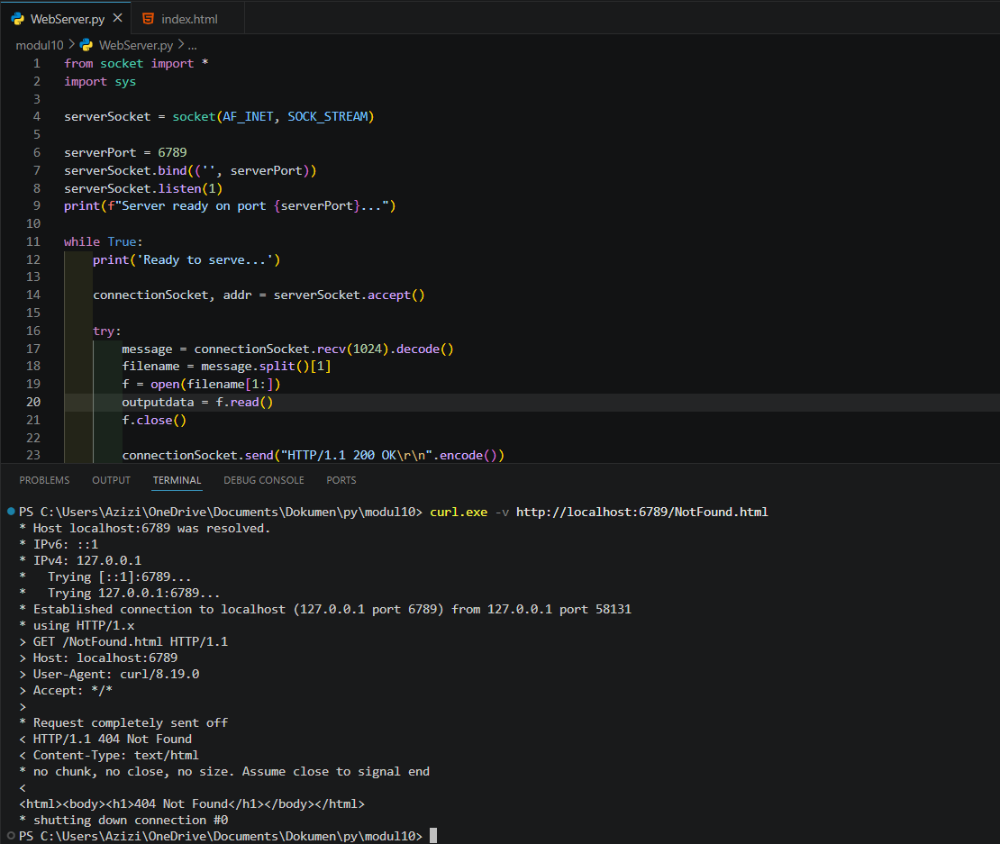
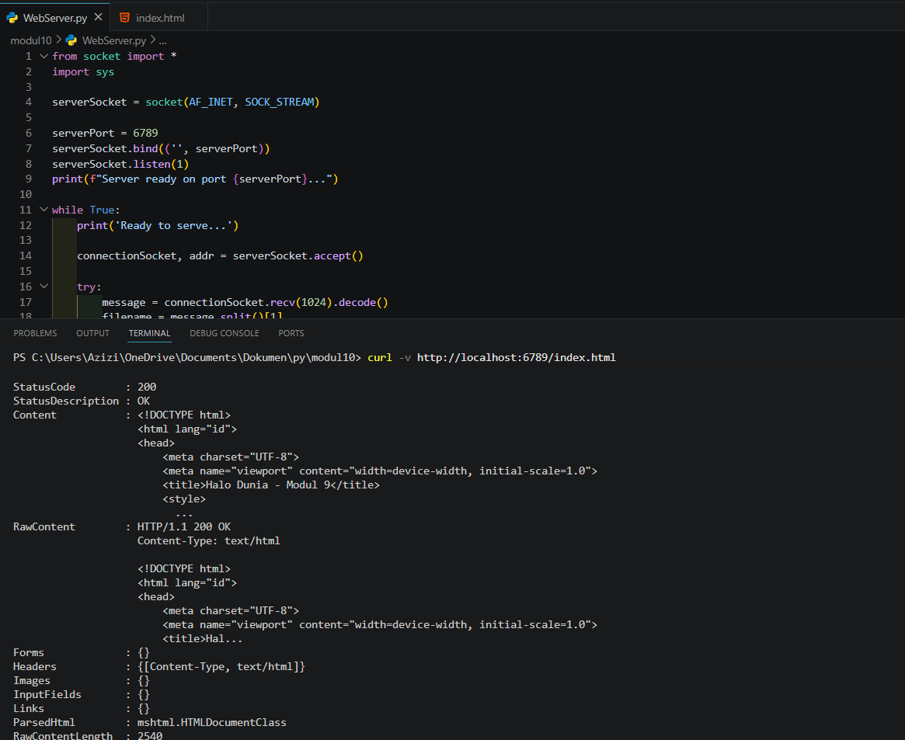

# Laporan Praktikum Jaringan Komputer - Modul 9
## Web Server Programming dengan Python Socket

### Identitas Praktikan
| Item | Keterangan |
|------|-----------|
| **Nama** | Muhammad Rohman Azizi |
| **NIM** | 103072400011 |
| **Kelas** | IF-04-01 |

---

## 1. Tujuan Praktikum
1. Membuat web server sederhana menggunakan TCP socket programming
2. Memahami format HTTP request dan response
3. Menangani file request dan error 404 Not Found
4. Menguji server menggunakan browser dan command line

---

## 2. Kode Program Web Server

**File:** `WebServer.py`

```python
from socket import *
import sys

serverSocket = socket(AF_INET, SOCK_STREAM)

serverPort = 6789
serverSocket.bind(('', serverPort))
serverSocket.listen(1)
print(f"Server ready on port {serverPort}...")

while True:
    print('Ready to serve...')
    
    connectionSocket, addr = serverSocket.accept()
    
    try:
        message = connectionSocket.recv(1024).decode()
        filename = message.split()[1]
        f = open(filename[1:])
        outputdata = f.read()
        f.close()
        
        connectionSocket.send("HTTP/1.1 200 OK\r\n".encode())
        connectionSocket.send("Content-Type: text/html\r\n".encode())
        connectionSocket.send("\r\n".encode())
        
        for i in range(0, len(outputdata)):
            connectionSocket.send(outputdata[i].encode())
        connectionSocket.send("\r\n".encode())
        connectionSocket.close()
        
    except IOError:
        # Send 404 response
        connectionSocket.send("HTTP/1.1 404 Not Found\r\n".encode())
        connectionSocket.send("Content-Type: text/html\r\n".encode())
        connectionSocket.send("\r\n".encode())
        connectionSocket.send("<html><body><h1>404 Not Found</h1></body></html>\r\n".encode())
        connectionSocket.close()

serverSocket.close()
sys.exit()
```

---

## 3. File HTML Testing

**File:** `HelloWorld.html`

```html
<!DOCTYPE html>
<html lang="id">
<head>
    <meta charset="UTF-8">
    <meta name="viewport" content="width=device-width, initial-scale=1.0">
    <title>Halo Dunia - Modul 9</title>
    <style>
        body {
            margin: 0;
            min-height: 100vh;
            display: flex;
            align-items: center;
            justify-content: center;
            font-family: 'Segoe UI', Tahoma, Geneva, Verdana, sans-serif;
            background: linear-gradient(45deg, #ff6b6b, #4ecdc4, #45b7d1);
            background-size: 200% 200%;
            animation: gradientBG 10s ease infinite;
        }

        @keyframes gradientBG {
            0% { background-position: 0% 50%; }
            50% { background-position: 100% 50%; }
            100% { background-position: 0% 50%; }
        }

        .card {
            background: rgba(255, 255, 255, 0.15); 
            backdrop-filter: blur(12px);
            -webkit-backdrop-filter: blur(12px);
            border: 1px solid rgba(255, 255, 255, 0.3);
            border-radius: 24px;
            padding: 60px 80px;
            text-align: center;
            box-shadow: 0 8px 32px 0 rgba(0, 0, 0, 0.2);
            color: white;
            transition: transform 0.4s ease, box-shadow 0.4s ease;
        }

        .card:hover {
            transform: translateY(-10px);
            box-shadow: 0 15px 40px 0 rgba(0, 0, 0, 0.3);
        }

        h1 {
            margin: 0 0 20px 0;
            font-size: 3.5rem;
            text-shadow: 2px 2px 4px rgba(0, 0, 0, 0.2);
            letter-spacing: 2px;
        }

        .footer {
            font-size: 1.2rem;
            font-weight: 500;
            letter-spacing: 4px;
            text-transform: uppercase;
            opacity: 0.9;
            border-top: 1px solid rgba(255, 255, 255, 0.4);
            padding-top: 20px;
            margin-top: 10px;
        }
    </style>
</head>
<body>

    <div class="card">
        <h1>Halo Dunia!</h1>
        <div class="footer">
            Modul 9
        </div>
    </div>

</body>
</html>
```
---

## 4. Hasil Praktikum

### 4.1 Struktur Folder dan File

**Lokasi File:**
```
modul10/
├── HelloWorld.html  
└── WebServer.py

```
---

### 4.2 Source Code Web Server

**Kode di VS Code:**

Kode program web server dengan penjelasan:
- Baris 1-2: Import library socket dan sys
- Baris 5-11: Setup server socket dan binding ke port 6789
- Baris 13-18: Looping untuk accept koneksi client
- Baris 20-24: Parse HTTP request dan baca file
- Baris 26-30: Kirim HTTP response 200 OK dengan isi file
- Baris 32-37: Handle error 404 Not Found

---

### 4.3 Test via Browser - Success (200 OK)

**URL:** `http://localhost:6789/index.html`

**Hasil:**



Halaman berhasil ditampilkan dengan:
- Judul "Selamat Datang!"
- Informasi praktikan lengkap
- Status HTTP **200 OK**

---

### 4.4 Test via Browser - Detail Halaman

**Tampilan lengkap:**


Semua elemen HTML ter-render sempurna:
- Heading H1
- Paragraf dengan styling
- Horizontal rule (`<hr>`)
- Text formatting (bold dengan `<strong>`, italic dengan `<em>`)

---

### 4.5 Test via Browser - File Tidak Ada (404 Not Found)

**URL:** `http://localhost:6789/FileTidakAda.html`

**Hasil:**



Server berhasil menangani error:
- Menampilkan **"404 Not Found"**
- Response HTTP **404** dikirim dengan benar
- HTML sederhana ditampilkan di browser

---

### 4.6 Test via curl - File Tidak Ada

**Command:**
```powershell
curl.exe -v http://localhost:6789/NotFound.html
```

**Output:**
```
< HTTP/1.1 404 Not Found
< Content-Type: text/html
< 
<html><body><h1>404 Not Found</h1></body></html>
```



Response 404 terverifikasi via command line dengan:
- Status code: **404 Not Found**
- Content-Type: **text/html**
- Body: HTML dengan heading "404 Not Found"

---

### 4.7 Test via curl - File Ada (200 OK)

**Command:**
```powershell
curl -v http://localhost:6789/HelloWorld.html
```

**Output:**
```
StatusCode        : 200
StatusDescription : OK
Content           : <!DOCTYPE html>
                    <html>
                    <head>
                        <title>Hello World - Praktikum Modul 9</title>
                    </head>
                    <body>
                        <h1>Selamat Datang!</h1>
                        <p>Ini adalah halaman web dari server Python socket.</p>
                        ...

RawContent        : HTTP/1.1 200 OK
                    Content-Type: text/html
                    <!DOCTYPE html>...
```



Response lengkap menunjukkan:
- Status code **200 OK**
- Content-Type: **text/html**
- Isi file HTML lengkap ter-parse dengan benar

---

## 5. Analisis HTTP Request/Response

### 5.1 HTTP Request (dari Browser)
```
GET /index.html HTTP/1.1
Host: localhost:6789
User-Agent: Mozilla/5.0 (Windows NT 10.0; Win64; x64)...
Accept: text/html,application/xhtml+xml,application/xml;q=0.9,*/*;q=0.8
Accept-Language: en-US,en;q=0.5
Connection: keep-alive
```

### 5.2 HTTP Response (200 OK)
```
HTTP/1.1 200 OK
Content-Type: text/html

<!DOCTYPE html>
<html lang="id">
<head>
    <meta charset="UTF-8">
    <meta name="viewport" content="width=device-width, initial-scale=1.0">
    <title>Halo Dunia - Modul 9</title>
    <style>
        body {
            margin: 0;
            min-height: 100vh;
            display: flex;
            align-items: center;
            justify-content: center;
            font-family: 'Segoe UI', Tahoma, Geneva, Verdana, sans-serif;
            background: linear-gradient(45deg, #ff6b6b, #4ecdc4, #45b7d1);
            background-size: 200% 200%;
            animation: gradientBG 10s ease infinite;
        }

        @keyframes gradientBG {
            0% { background-position: 0% 50%; }
            50% { background-position: 100% 50%; }
            100% { background-position: 0% 50%; }
        }

        .card {
            background: rgba(255, 255, 255, 0.15); 
            backdrop-filter: blur(12px);
            -webkit-backdrop-filter: blur(12px);
            border: 1px solid rgba(255, 255, 255, 0.3);
            border-radius: 24px;
            padding: 60px 80px;
            text-align: center;
            box-shadow: 0 8px 32px 0 rgba(0, 0, 0, 0.2);
            color: white;
            transition: transform 0.4s ease, box-shadow 0.4s ease;
        }

        .card:hover {
            transform: translateY(-10px);
            box-shadow: 0 15px 40px 0 rgba(0, 0, 0, 0.3);
        }

        h1 {
            margin: 0 0 20px 0;
            font-size: 3.5rem;
            text-shadow: 2px 2px 4px rgba(0, 0, 0, 0.2);
            letter-spacing: 2px;
        }

        .footer {
            font-size: 1.2rem;
            font-weight: 500;
            letter-spacing: 4px;
            text-transform: uppercase;
            opacity: 0.9;
            border-top: 1px solid rgba(255, 255, 255, 0.4);
            padding-top: 20px;
            margin-top: 10px;
        }
    </style>
</head>
<body>

    <div class="card">
        <h1>Halo Dunia!</h1>
        <div class="footer">
            Modul 9
        </div>
    </div>

</body>
</html>
```

### 5.3 HTTP Response (404 Not Found)
```
HTTP/1.1 404 Not Found
Content-Type: text/html

<html><body><h1>404 Not Found</h1></body></html>
```

---

## 6. Penjelasan Kode

### 6.1 Setup Server Socket
```python
serverSocket = socket(AF_INET, SOCK_STREAM)
serverPort = 6789
serverSocket.bind(('', serverPort))  
serverSocket.listen(1)                
print(f"Server ready on port {serverPort}...")
```
- Membuat socket TCP dengan `AF_INET` (IPv4) dan `SOCK_STREAM` (TCP)
- Bind ke port **6789** di semua network interface
- Server mulai listening untuk koneksi masuk

### 6.2 Accept Koneksi Client
```python
while True:
    print('Ready to serve...')
    connectionSocket, addr = serverSocket.accept()
```
- Looping tanpa batas untuk handle multiple requests
- `accept()` membuat socket khusus (`connectionSocket`) untuk client ini
- `addr` berisi tuple (IP_client, port_client)

### 6.3 Parse HTTP Request
```python
try:
    message = connectionSocket.recv(1024).decode()
    filename = message.split()[1]     
    f = open(filename[1:])             
    outputdata = f.read()
    f.close()
```
- Terima HTTP request (max 1024 bytes) dan decode dari bytes ke string
- Split message dan ambil elemen kedua (filename)
- Hilangkan karakter "/" pertama dengan `filename[1:]`
- Baca isi file ke variabel `outputdata`

### 6.4 Kirim HTTP Response (200 OK)
```python
connectionSocket.send("HTTP/1.1 200 OK\r\n".encode())
connectionSocket.send("Content-Type: text/html\r\n".encode())
connectionSocket.send("\r\n".encode())  

for i in range(0, len(outputdata)):
    connectionSocket.send(outputdata[i].encode())
connectionSocket.send("\r\n".encode())
connectionSocket.close()
```
- **Status line:** `HTTP/1.1 200 OK`
- **Header:** `Content-Type: text/html`
- **Blank line:** `\r\n` menandakan akhir headers
- **Body:** Kirim isi file character by character
- Tutup koneksi setelah selesai

### 6.5 Handle Error (404 Not Found)
```python
except IOError:
    connectionSocket.send("HTTP/1.1 404 Not Found\r\n".encode())
    connectionSocket.send("Content-Type: text/html\r\n".encode())
    connectionSocket.send("\r\n".encode())
    connectionSocket.send("<html><body><h1>404 Not Found</h1></body></html>\r\n".encode())
    connectionSocket.close()
```
- Jika file tidak ditemukan → throw `IOError`
- Kirim response **404 Not Found**
- Sertakan HTML sederhana dengan pesan error
- Tutup koneksi client

---

## 7. Kesimpulan

Berdasarkan praktikum yang telah dilakukan:

1. **Web server berhasil dibuat** dengan ~40 baris kode Python menggunakan TCP socket programming.

2. **Server berjalan di port 6789** dan dapat diakses via:
   - Browser: `http://localhost:6789/HelloWorld.html` 
   - Command line: `curl http://localhost:6789/HelloWorld.html`

3. **HTTP Response berhasil diimplementasikan:**
   - Status **200 OK** untuk file yang ada
   - Status **404 Not Found** untuk file yang tidak ada
   - Content-Type header dikirim dengan benar

4. **Format HTTP sesuai standar RFC 7230:**
   - Request: `GET /filename HTTP/1.1` + headers
   - Response: `HTTP/1.1 STATUS_CODE` + headers + blank line + body

5. **Server handling berfungsi dengan baik:**
   - `accept()` → buat socket khusus per client
   - `recv()` → baca HTTP request
   - Parse filename → buka file → kirim response
   - `close()` → tutup koneksi setelah selesai

6. **Error handling** dengan try-except berhasil menangani file tidak found (IOError).

7. **Testing komprehensif** via browser dan curl menunjukkan server berfungsi dengan baik untuk kedua skenario (file ada dan file tidak ada).

8. **Struktur folder** terorganisir dengan file HTML dan Python server di direktori yang sama.